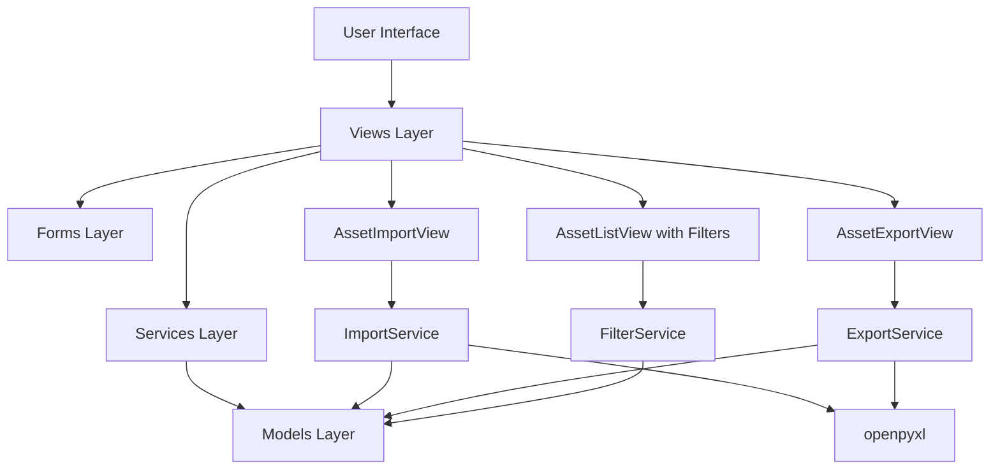
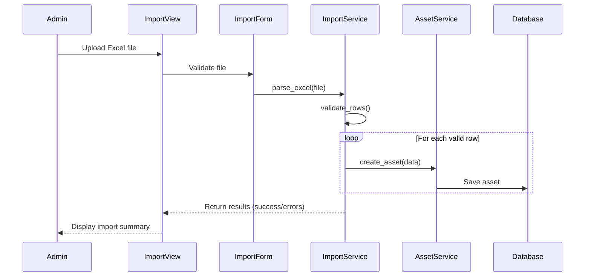
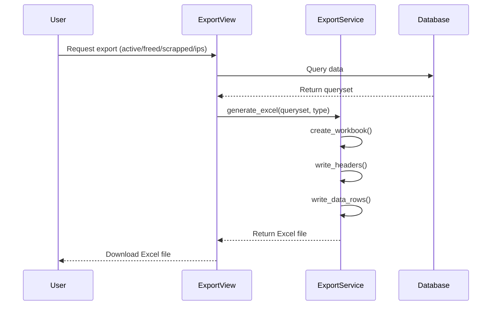
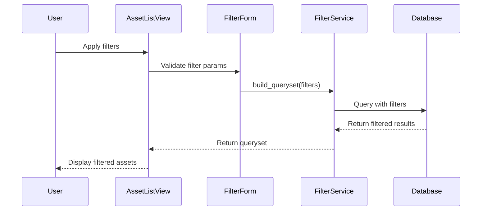

# Design Document: Asset Import/Export/Filters

## Overview

This feature enhances the Asset Tracking System with three key capabilities: bulk Excel import for assets (admin-only), Excel export functionality for various asset views (active, freed, scrapped, free IPs), and comprehensive filtering on the asset list page. The design leverages Python's openpyxl library for Excel operations and Django's QuerySet filtering for efficient data retrieval. The implementation maintains the existing architecture while adding new views, services, and forms to support these operations.

## Architecture



## Sequence Diagrams

### Excel Import Flow



### Excel Export Flow



### Filtering Flow



## Components and Interfaces

### Component 1: ImportService

**Purpose**: Handle Excel file parsing, validation, and bulk asset creation

**Interface**:
```python
class ImportService:
    def parse_excel(self, file) -> Dict[str, Any]:
        """Parse Excel file and extract asset data"""
        pass
    
    def validate_row(self, row_data: Dict, row_number: int) -> Tuple[bool, List[str]]:
        """Validate a single row of data"""
        pass
    
    def import_assets(self, file, user) -> Dict[str, Any]:
        """Import assets from Excel file"""
        pass
```

**Responsibilities**:
- Parse Excel files (.xlsx, .xls)
- Validate data integrity (required fields, duplicates, foreign keys)
- Coordinate with AssetService for asset creation
- Track success and error counts
- Generate detailed error reports

### Component 2: ExportService

**Purpose**: Generate Excel files from querysets

**Interface**:
```python
class ExportService:
    def export_active_assets(self) -> HttpResponse:
        """Export active assets to Excel"""
        pass
    
    def export_freed_assets(self) -> HttpResponse:
        """Export freed assets to Excel"""
        pass
    
    def export_scrapped_assets(self) -> HttpResponse:
        """Export scrapped assets to Excel"""
        pass
    
    def export_free_ips(self) -> HttpResponse:
        """Export free IP addresses to Excel"""
        pass
    
    def _create_workbook(self, queryset, columns: List[str], title: str) -> Workbook:
        """Create Excel workbook from queryset"""
        pass
```

**Responsibilities**:
- Generate Excel workbooks with proper formatting
- Include all relevant columns for each export type
- Set appropriate headers and column widths
- Return HTTP response with file download

### Component 3: FilterService

**Purpose**: Build filtered querysets based on user criteria

**Interface**:
```python
class FilterService:
    def apply_filters(self, queryset, filters: Dict) -> QuerySet:
        """Apply multiple filters to asset queryset"""
        pass
    
    def filter_by_os(self, queryset, os_id: int) -> QuerySet:
        """Filter by operating system"""
        pass
    
    def filter_by_asset_tag(self, queryset, asset_tag: str) -> QuerySet:
        """Filter by BIDC number (asset tag)"""
        pass
    
    def filter_by_team(self, queryset, team_id: int) -> QuerySet:
        """Filter by team"""
        pass
    
    def filter_by_assigned_user(self, queryset, user_name: str) -> QuerySet:
        """Filter by assigned user name"""
        pass
```

**Responsibilities**:
- Build Django QuerySet filters dynamically
- Support multiple simultaneous filters
- Handle partial matches for text fields
- Maintain query efficiency with proper indexing

## Data Models

### Excel Import Format

```python
# Expected Excel columns for import
IMPORT_COLUMNS = {
    'asset_tag': str,          # Required, unique
    'system_type': str,        # Required, choices: Desktop/Laptop/All-in-One PC
    'operating_system': str,   # Required, must exist in DB
    'ip_address': str,         # Required, must be free
    'particulars': str,        # Optional
    'assigned_to': str,        # Optional
    'team': str,               # Optional, must exist in DB
    'warranty_expiration': str # Optional, format: YYYY-MM-DD
}
```

**Validation Rules**:
- asset_tag: Must be unique, non-empty
- system_type: Must be one of the valid choices
- operating_system: Must match existing OS name
- ip_address: Must be valid IPv4 and available
- team: Must match existing team name if provided
- warranty_expiration: Must be valid date format if provided

### Filter Parameters

```python
class AssetFilterParams:
    operating_system: Optional[int]  # OS ID
    asset_tag: Optional[str]         # Partial match
    team: Optional[int]              # Team ID
    assigned_to: Optional[str]       # Partial match on user name
```

## Key Functions with Formal Specifications

### Function 1: import_assets()

```python
def import_assets(self, file, user) -> Dict[str, Any]:
    """
    Import assets from Excel file with validation
    
    Returns:
        {
            'success_count': int,
            'error_count': int,
            'errors': List[Dict[str, Any]]
        }
    """
```

**Preconditions:**
- file is a valid Excel file (.xlsx or .xls)
- user is authenticated and has admin privileges
- file contains required columns

**Postconditions:**
- All valid rows are imported as assets
- Invalid rows are reported with specific error messages
- No partial imports (transaction rollback on critical errors)
- Returns summary with success/error counts

**Loop Invariants:**
- For each processed row: validation occurs before database write
- All previously processed rows remain valid
- Error list grows monotonically

### Function 2: export_active_assets()

```python
def export_active_assets(self) -> HttpResponse:
    """
    Export all active assets to Excel file
    
    Returns:
        HttpResponse with Excel file attachment
    """
```

**Preconditions:**
- User is authenticated
- Active assets exist in database (may be empty)

**Postconditions:**
- Returns Excel file with all active assets
- File includes columns: serial_number, asset_tag, system_type, OS, IP, assigned_to, team, warranty_expiration
- File is properly formatted with headers
- HTTP response has correct content-type and filename

**Loop Invariants:** N/A

### Function 3: apply_filters()

```python
def apply_filters(self, queryset, filters: Dict) -> QuerySet:
    """
    Apply multiple filters to asset queryset
    
    Args:
        queryset: Base QuerySet to filter
        filters: Dict of filter parameters
    
    Returns:
        Filtered QuerySet
    """
```

**Preconditions:**
- queryset is a valid Django QuerySet
- filters dict contains valid filter keys
- Filter values are properly typed

**Postconditions:**
- Returns filtered QuerySet
- Multiple filters are combined with AND logic
- Empty filters dict returns original queryset
- Invalid filter keys are ignored

**Loop Invariants:**
- For each filter applied: queryset size decreases or stays same
- Filter order does not affect final result

## Algorithmic Pseudocode

### Main Import Algorithm

```python
def import_assets(file, user):
    """
    INPUT: file (Excel), user (User object)
    OUTPUT: Dict with success_count, error_count, errors list
    """
    # Step 1: Parse Excel file
    workbook = openpyxl.load_workbook(file)
    sheet = workbook.active
    headers = [cell.value for cell in sheet[1]]
    
    # Step 2: Validate headers
    if not validate_headers(headers):
        return {'success_count': 0, 'error_count': 0, 
                'errors': [{'row': 0, 'message': 'Invalid headers'}]}
    
    # Step 3: Process rows with transaction
    success_count = 0
    error_count = 0
    errors = []
    
    with transaction.atomic():
        for row_num, row in enumerate(sheet.iter_rows(min_row=2), start=2):
            row_data = dict(zip(headers, [cell.value for cell in row]))
            
            # Validate row
            is_valid, validation_errors = validate_row(row_data, row_num)
            
            if not is_valid:
                error_count += 1
                errors.append({
                    'row': row_num,
                    'data': row_data,
                    'errors': validation_errors
                })
                continue
            
            # Create asset
            try:
                asset_service.create_asset(row_data, user)
                success_count += 1
            except Exception as e:
                error_count += 1
                errors.append({
                    'row': row_num,
                    'data': row_data,
                    'errors': [str(e)]
                })
    
    return {
        'success_count': success_count,
        'error_count': error_count,
        'errors': errors
    }
```

**Preconditions:**
- file is valid Excel format
- user has admin permissions
- Database connection is available

**Postconditions:**
- All valid rows imported successfully
- All errors logged with row numbers
- Transaction committed only if no critical errors

**Loop Invariants:**
- success_count + error_count = number of processed rows
- errors list contains exactly error_count entries
- All processed assets are valid

### Export Algorithm

```python
def export_active_assets():
    """
    INPUT: None
    OUTPUT: HttpResponse with Excel file
    """
    # Step 1: Query active assets
    assets = Asset.objects.filter(status='active').select_related(
        'operating_system', 'team', 'ip_address'
    ).order_by('serial_number')
    
    # Step 2: Create workbook
    workbook = openpyxl.Workbook()
    sheet = workbook.active
    sheet.title = "Active Assets"
    
    # Step 3: Write headers
    headers = ['Serial Number', 'Asset Tag', 'System Type', 'OS', 
               'IP Address', 'Assigned To', 'Team', 'Warranty Expiration']
    sheet.append(headers)
    
    # Step 4: Write data rows
    for asset in assets:
        row = [
            asset.serial_number,
            asset.asset_tag,
            asset.system_type,
            asset.operating_system.name,
            asset.ip_address.address if asset.ip_address else '',
            asset.assigned_to or '',
            asset.team.name if asset.team else '',
            asset.warranty_expiration.strftime('%Y-%m-%d') if asset.warranty_expiration else ''
        ]
        sheet.append(row)
    
    # Step 5: Format and return
    response = HttpResponse(
        content_type='application/vnd.openxmlformats-officedocument.spreadsheetml.sheet'
    )
    response['Content-Disposition'] = 'attachment; filename=active_assets.xlsx'
    workbook.save(response)
    
    return response
```

**Preconditions:**
- Database connection available
- User is authenticated

**Postconditions:**
- Excel file contains all active assets
- Headers match expected columns
- Data is properly formatted
- File is downloadable

**Loop Invariants:**
- Each asset produces exactly one row
- Row order matches queryset order

### Filter Application Algorithm

```python
def apply_filters(queryset, filters):
    """
    INPUT: queryset (QuerySet), filters (Dict)
    OUTPUT: Filtered QuerySet
    """
    filtered_qs = queryset
    
    # Filter by operating system
    if filters.get('operating_system'):
        filtered_qs = filtered_qs.filter(
            operating_system_id=filters['operating_system']
        )
    
    # Filter by asset tag (partial match)
    if filters.get('asset_tag'):
        filtered_qs = filtered_qs.filter(
            asset_tag__icontains=filters['asset_tag']
        )
    
    # Filter by team
    if filters.get('team'):
        filtered_qs = filtered_qs.filter(
            team_id=filters['team']
        )
    
    # Filter by assigned user (partial match)
    if filters.get('assigned_to'):
        filtered_qs = filtered_qs.filter(
            assigned_to__icontains=filters['assigned_to']
        )
    
    return filtered_qs
```

**Preconditions:**
- queryset is valid Django QuerySet
- filters dict contains valid keys
- Filter values are properly typed

**Postconditions:**
- Returns filtered QuerySet
- Filters combined with AND logic
- Empty filters returns original queryset
- Query is not executed until iteration

**Loop Invariants:**
- Each filter application maintains QuerySet validity
- Filter order does not affect result

## Example Usage

### Example 1: Import Assets from Excel

```python
# In view
from assets.services.import_service import ImportService

def asset_import_view(request):
    if request.method == 'POST':
        form = AssetImportForm(request.POST, request.FILES)
        if form.is_valid():
            file = request.FILES['file']
            import_service = ImportService()
            result = import_service.import_assets(file, request.user)
            
            messages.success(request, 
                f"Imported {result['success_count']} assets successfully")
            
            if result['error_count'] > 0:
                messages.warning(request, 
                    f"{result['error_count']} rows had errors")
            
            return render(request, 'assets/import_results.html', {
                'result': result
            })
    else:
        form = AssetImportForm()
    
    return render(request, 'assets/import_form.html', {'form': form})
```

### Example 2: Export Active Assets

```python
# In view
from assets.services.export_service import ExportService

def export_active_assets_view(request):
    export_service = ExportService()
    return export_service.export_active_assets()
```

### Example 3: Apply Filters

```python
# In view
from assets.services.filter_service import FilterService

def asset_list_view(request):
    queryset = Asset.objects.filter(status='active')
    
    filter_form = AssetFilterForm(request.GET)
    if filter_form.is_valid():
        filter_service = FilterService()
        queryset = filter_service.apply_filters(
            queryset, 
            filter_form.cleaned_data
        )
    
    return render(request, 'assets/asset_list.html', {
        'assets': queryset,
        'filter_form': filter_form
    })
```

## Correctness Properties

### Property 1: Import Atomicity
∀ import operations: Either all valid rows are imported OR none are imported (on critical error)

### Property 2: Import Validation Completeness
∀ rows in Excel file: Row is imported ⟹ Row passes all validation rules

### Property 3: Export Completeness
∀ export operations: Exported data set = Queried data set (no data loss)

### Property 4: Export Column Consistency
∀ export types: Headers match data columns exactly

### Property 5: Filter Composition
∀ filter combinations: apply_filters(qs, {f1, f2}) = apply_filters(apply_filters(qs, {f1}), {f2})

### Property 6: Filter Idempotence
∀ filters f: apply_filters(apply_filters(qs, f), f) = apply_filters(qs, f)

### Property 7: Import Uniqueness
∀ imported assets: asset_tag is unique across all assets

### Property 8: IP Assignment Consistency
∀ imported assets with IP: IP is marked as assigned after import

### Property 9: Export Format Validity
∀ exported files: File is valid Excel format and can be re-imported

### Property 10: Filter Result Subset
∀ filters f: |apply_filters(qs, f)| ≤ |qs|

## Error Handling

### Error Scenario 1: Invalid Excel File

**Condition**: User uploads non-Excel file or corrupted file
**Response**: Display error message "Invalid file format. Please upload .xlsx or .xls file"
**Recovery**: Allow user to upload different file

### Error Scenario 2: Missing Required Columns

**Condition**: Excel file missing required columns (asset_tag, system_type, etc.)
**Response**: Display error with list of missing columns
**Recovery**: User must fix Excel file and re-upload

### Error Scenario 3: Duplicate Asset Tag in Import

**Condition**: Excel row contains asset_tag that already exists in database
**Response**: Skip row, add to error list with message "Asset tag already exists"
**Recovery**: Continue processing other rows, display summary at end

### Error Scenario 4: Invalid Foreign Key Reference

**Condition**: Excel row references non-existent OS or Team
**Response**: Skip row, add to error list with message "Operating System/Team not found"
**Recovery**: Continue processing other rows

### Error Scenario 5: IP Address Not Available

**Condition**: Excel row specifies IP that is already assigned
**Response**: Skip row, add to error list with message "IP address not available"
**Recovery**: Continue processing other rows

### Error Scenario 6: Export with No Data

**Condition**: User requests export but no data matches criteria
**Response**: Generate Excel file with headers only
**Recovery**: N/A (valid operation)

### Error Scenario 7: Filter with Invalid Parameters

**Condition**: User submits filter form with invalid values
**Response**: Display form validation errors
**Recovery**: User corrects filter values and resubmits

## Testing Strategy

### Unit Testing Approach

Test each service method independently with mocked dependencies:
- ImportService: Test parse_excel, validate_row, import_assets with sample Excel files
- ExportService: Test workbook generation, header formatting, data serialization
- FilterService: Test each filter method and filter composition

Key test cases:
- Valid import with all fields populated
- Import with missing optional fields
- Import with validation errors
- Export with empty queryset
- Export with large dataset (performance)
- Single filter application
- Multiple filter combination
- Filter with no matches

### Property-Based Testing Approach

Use Hypothesis to generate random test data and verify correctness properties:

**Property Test Library**: Hypothesis (Python)

**Test 1: Import-Export Roundtrip**
- Generate random valid asset data
- Import to database
- Export to Excel
- Verify exported data matches imported data

**Test 2: Filter Monotonicity**
- Generate random asset dataset
- Apply random filter combinations
- Verify filtered set size ≤ original set size

**Test 3: Import Validation Consistency**
- Generate random Excel rows (valid and invalid)
- Verify all imported rows pass validation
- Verify all rejected rows fail validation

### Integration Testing Approach

Test complete workflows end-to-end:
- Upload Excel → Import → Verify in database → Export → Compare files
- Apply filters → Export filtered results → Verify Excel contains only filtered data
- Import with errors → Verify error reporting → Verify partial import handling

## Performance Considerations

### Import Performance
- Use bulk_create for batch inserts when possible
- Validate all rows before starting database writes
- Use select_related for foreign key lookups during validation
- Consider chunking for very large files (>1000 rows)

### Export Performance
- Use select_related and prefetch_related to minimize queries
- Stream large exports to avoid memory issues
- Add database indexes on filtered fields (already exist: asset_tag, status)

### Filter Performance
- Leverage existing database indexes
- Use Q objects for complex filter combinations
- Avoid N+1 queries with select_related
- Consider caching for frequently used filter combinations

## Security Considerations

### Import Security
- Restrict import functionality to admin users only (AdminRequiredMixin)
- Validate file size limits (max 10MB)
- Sanitize Excel cell values to prevent injection attacks
- Use Django's transaction.atomic() for data integrity

### Export Security
- Authenticate all export requests
- Log export operations for audit trail
- Consider rate limiting for export endpoints
- Ensure exported files don't contain sensitive data beyond user's permissions

### Filter Security
- Sanitize filter inputs to prevent SQL injection
- Use Django ORM (parameterized queries) exclusively
- Validate filter parameters against whitelist
- Limit result set size to prevent DoS

## Dependencies

### Python Libraries
- openpyxl (3.1.2+): Excel file reading and writing
- Django (4.2+): Web framework (already installed)
- django-crispy-forms (optional): Form rendering

### Django Apps
- assets: Existing app (models, services, views)
- authentication: User authentication (already exists)

### External Services
- None (all operations are local)

### Database
- SQLite/PostgreSQL: Existing database with Asset, OperatingSystem, Team, IPAddress models
