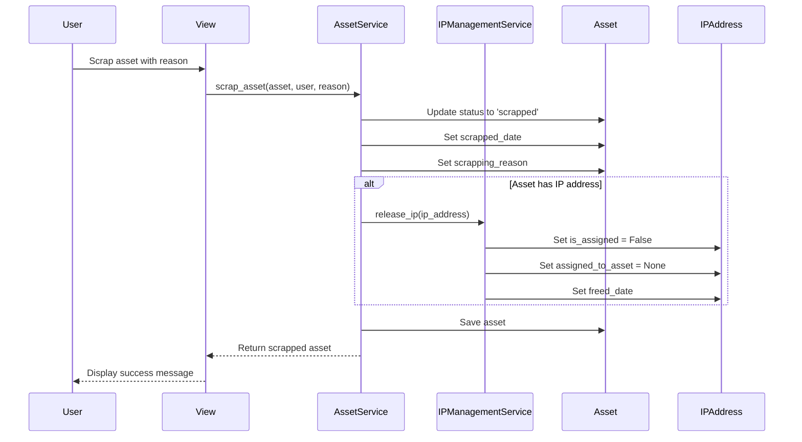

# Design Document: Enhanced Scrapped Items

## Overview

This design specifies the implementation for enhancing the scrapped items functionality in the Asset Tracker application. The enhancement adds two new fields to the Asset model (manufacturer and scrapping_reason), automatically releases IP addresses when assets are scrapped, and provides comprehensive visibility into IP address lifecycle across both scrapped items and free IP pages.

The design leverages existing components including the Asset model, AssetService, IPManagementService, and associated templates. The implementation focuses on minimal changes to existing code while adding the required functionality.

## Architecture

The enhanced scrapped items feature follows the existing three-tier architecture:

1. **Data Layer**: Asset and IPAddress models with new fields
2. **Service Layer**: AssetService.scrap_asset() method enhanced with IP release logic
3. **Presentation Layer**: Updated templates for scrapped items and free IPs pages

### Component Interaction Flow



## Components and Interfaces

### 1. Asset Model Extensions

**File**: `assets/models.py`

**New Fields**:
- `manufacturer`: CharField(max_length=100, blank=True, null=True)
  - Stores the manufacturer/brand of the asset
  - Optional field to support existing data
  - Displayed as "System Make" in UI

- `scrapping_reason`: TextField(blank=True, null=True)
  - Stores the explanation for why the asset was scrapped
  - Required when scrapping an asset (enforced at service layer)
  - Supports detailed multi-line explanations

**Migration Considerations**:
- Both fields are nullable to support existing scrapped assets
- No default values needed
- Database indexes not required (infrequent queries)

### 2. IPAddress Model Extensions

**File**: `assets/models.py`

**New Field**:
- `freed_date`: DateTimeField(null=True, blank=True)
  - Tracks when an IP address was released from an asset
  - Set automatically by IPManagementService.release_ip()
  - Used to display IP release history on Free IPs page

### 3. AssetService.scrap_asset() Enhancement

**File**: `assets/services/asset_service.py`

**Current Signature**:
```python
def scrap_asset(asset, user):
```

**New Signature**:
```python
def scrap_asset(asset, user, scrapping_reason):
```

**Enhanced Logic**:
1. Validate asset status is 'freed' (existing)
2. Validate scrapping_reason is provided and non-empty (new)
3. Set asset.status = 'scrapped' (existing)
4. Set asset.scrapped_date = timezone.now() (existing)
5. Set asset.scrapping_reason = scrapping_reason (new)
6. **Release IP address if assigned** (new):
   - Call IPManagementService.release_ip(asset.ip_address)
   - Preserve asset.ip_address reference for historical record
7. Save asset (existing)

**Key Design Decision**: The IP address reference on the asset is NOT cleared when scrapping. This preserves the historical record of which IP was assigned to the asset. The IPAddress.is_assigned flag and assigned_to_asset reference are cleared to make the IP available for reassignment.

### 4. IPManagementService.release_ip() Enhancement

**File**: `assets/services/ip_management_service.py`

**Enhanced Logic**:
```python
def release_ip(ip_address):
    with transaction.atomic():
        ip_address.is_assigned = False
        ip_address.assigned_to_asset = None
        ip_address.freed_date = timezone.now()  # NEW
        ip_address.save()
```

### 5. Scrapped Items Template Enhancement

**File**: `assets/templates/assets/scrapped_items.html`

**New Table Columns**:
- Asset Tag (existing)
- IP Address (existing, enhanced with status indicator)
- System Type (new)
- System Make (new)
- Scrapped Date (existing)
- Scrapping Reason (new)

**IP Address Status Indicator**:
- Display IP address value for all scrapped assets
- If IP is reassigned (is_assigned=True), display in red with "(Reassigned)" label
- If IP is still free (is_assigned=False), display in normal color

**Implementation**:
```html
<td>
    
        
            <span style="color: red;">{{ asset.ip_address.address }} (Reassigned)</span>
        
            {{ asset.ip_address.address }}
        
    
        N/A
    
</td>
```

### 6. Free IPs Template Enhancement

**File**: `assets/templates/assets/free_ips.html`

**New Display Information**:
- Freed Date column for each IP address
- Source indicator (freed from scrapped asset vs. never assigned)

**Enhanced IP Item Display**:
```html
<div class="ip-item occupiedfree" 
     title="OccupiedFree (Freed: {{ ip.freed_date|date:'Y-m-d' }})">
    {{ ip.address }}
    
        <small class="freed-date">Freed: {{ ip.freed_date|date:"Y-m-d" }}</small>
    
</div>
```

### 7. View Layer Updates

**Scrapped Items View** (`assets/views.py`):
- No changes to view logic required
- Template receives queryset with select_related('ip_address') (already exists)

**Free IPs View** (`assets/views.py`):
- No changes to view logic required
- IPManagementService.get_all_ips_by_range() already returns all IPs with is_assigned status

## Data Models

### Asset Model (Enhanced)

```python
class Asset(models.Model):
    # Existing fields
    serial_number = models.AutoField(primary_key=True)
    asset_tag = models.CharField(max_length=50, unique=True, db_index=True)
    system_type = models.CharField(max_length=20, choices=SYSTEM_TYPE_CHOICES)
    hardware_serial_number = models.CharField(max_length=100, blank=True, null=True)
    operating_system = models.ForeignKey(OperatingSystem, on_delete=models.PROTECT)
    ip_address = models.ForeignKey(IPAddress, on_delete=models.SET_NULL, null=True, blank=True)
    particulars = models.TextField(blank=True, null=True)
    assigned_to = models.CharField(max_length=100, blank=True, null=True)
    team = models.ForeignKey(Team, on_delete=models.SET_NULL, null=True, blank=True)
    status = models.CharField(max_length=20, choices=STATUS_CHOICES, default='active')
    warranty_expiration = models.DateField(null=True, blank=True)
    freed_date = models.DateTimeField(null=True, blank=True)
    scrapped_date = models.DateTimeField(null=True, blank=True)
    created_at = models.DateTimeField(auto_now_add=True)
    updated_at = models.DateTimeField(auto_now=True)
    
    # NEW FIELDS
    manufacturer = models.CharField(max_length=100, blank=True, null=True, 
                                   help_text="Manufacturer or brand of the asset")
    scrapping_reason = models.TextField(blank=True, null=True,
                                       help_text="Explanation for why the asset was scrapped")
```

### IPAddress Model (Enhanced)

```python
class IPAddress(models.Model):
    # Existing fields
    address = models.GenericIPAddressField(protocol='IPv4', unique=True)
    ip_range = models.ForeignKey(IPRange, on_delete=models.CASCADE)
    is_assigned = models.BooleanField(default=False, db_index=True)
    assigned_to_asset = models.ForeignKey('Asset', on_delete=models.SET_NULL, 
                                         null=True, blank=True)
    
    # NEW FIELD
    freed_date = models.DateTimeField(null=True, blank=True,
                                     help_text="Date when IP was released from an asset")
```


## Correctness Properties

*A property is a characteristic or behavior that should hold true across all valid executions of a system-essentially, a formal statement about what the system should do. Properties serve as the bridge between human-readable specifications and machine-verifiable correctness guarantees.*

### Property Reflection

After analyzing all acceptance criteria, the following redundancies were identified:
- Criteria 3.4 is redundant with 1.3 (both test System_Make display)
- Criteria 3.6 is redundant with 2.3 (both test Scrapping_Reason display)
- Criteria 7.2 is redundant with 7.1 (both test IP reassignment indicator)
- Criteria 7.3 is redundant with 4.3 (both test IP reference preservation)

Additionally, criteria 3.1, 3.2, 3.3, 3.5 can be combined into a single comprehensive property that tests all required fields are displayed on the scrapped items page.

### Property 1: Manufacturer field persistence

*For any* asset with a manufacturer value, creating or updating the asset should result in the manufacturer value being stored and retrievable from the database.

**Validates: Requirements 1.1, 1.2**

### Property 2: Scrapping reason validation

*For any* freed asset, attempting to scrap it with an empty or whitespace-only scrapping reason should be rejected, and the asset status should remain 'freed'.

**Validates: Requirements 2.1, 2.2**


### Property 3: Scrapped items page displays all required fields

*For any* scrapped asset, the rendered scrapped items page HTML should contain the asset's IP address, asset tag (BIDC number), system type, manufacturer (system make), scrapped date, and scrapping reason.

**Validates: Requirements 1.3, 2.3, 3.1, 3.2, 3.3, 3.4, 3.5, 3.6**

### Property 4: IP release on scrapping

*For any* freed asset with an assigned IP address, scrapping the asset should result in the IP address being released (is_assigned=False, assigned_to_asset=None).

**Validates: Requirements 4.1**

### Property 5: Released IP appears in free IPs

*For any* asset with an IP address, after scrapping the asset, the IP address should appear in the free IPs queryset returned by IPManagementService.get_free_ips_by_range().

**Validates: Requirements 4.2, 5.1**

### Property 6: IP reference preservation on scrapping

*For any* scrapped asset that had an IP address, the asset.ip_address reference should still point to the same IPAddress object after scrapping (not set to None).

**Validates: Requirements 4.3, 7.3**


### Property 7: Freed date is set on IP release

*For any* IP address that is released, the freed_date field should be set to the current timestamp and should not be None.

**Validates: Requirements 5.3**

### Property 8: Free IPs page shows availability status

*For any* IP address displayed on the free IPs page, the rendered HTML should indicate whether the IP is available (is_assigned=False) or occupied (is_assigned=True).

**Validates: Requirements 5.2, 6.2**

### Property 9: Reassigned IPs display in red on free IPs page

*For any* IP address that is reassigned (is_assigned=True), the rendered free IPs page HTML should display the IP address with red color styling or a red CSS class.

**Validates: Requirements 6.1**

### Property 10: Scrapped items page shows IP reassignment status

*For any* scrapped asset whose IP address has been reassigned to another asset, the rendered scrapped items page HTML should indicate the IP is no longer available (e.g., with "(Reassigned)" label or different styling).

**Validates: Requirements 7.1, 7.2**


## Error Handling

### Validation Errors

**Empty Scrapping Reason**:
- **Trigger**: User attempts to scrap an asset without providing a scrapping reason
- **Response**: Raise ValidationError with message "Scrapping reason is required"
- **User Experience**: Display error message on form, prevent scrapping operation

**Invalid Asset Status**:
- **Trigger**: User attempts to scrap an asset that is not in 'freed' status
- **Response**: Raise ValidationError with message "Only freed assets can be scrapped"
- **User Experience**: Display error message, prevent scrapping operation

### Database Errors

**Migration Failures**:
- **Trigger**: Database migration fails when adding new fields
- **Response**: Roll back migration, log error details
- **Recovery**: Review migration script, check database permissions, retry

**Constraint Violations**:
- **Trigger**: Unexpected database constraint violation during save
- **Response**: Roll back transaction, log error with full context
- **Recovery**: Display generic error to user, investigate root cause

### Template Rendering Errors

**Missing IP Address**:
- **Trigger**: Asset has no IP address (ip_address=None)
- **Response**: Display "N/A" in IP address column
- **User Experience**: No error, graceful degradation

**Missing Manufacturer**:
- **Trigger**: Asset has no manufacturer value
- **Response**: Display empty cell or "N/A" in manufacturer column
- **User Experience**: No error, graceful degradation


## Testing Strategy

### Dual Testing Approach

This feature requires both unit tests and property-based tests for comprehensive coverage:

- **Unit tests**: Verify specific examples, edge cases, and error conditions
- **Property tests**: Verify universal properties across all inputs

Unit tests should focus on:
- Specific examples demonstrating correct behavior (e.g., scrapping a specific asset)
- Integration points between AssetService and IPManagementService
- Edge cases (asset with no IP, asset with no manufacturer)
- Error conditions (empty scrapping reason, invalid status)

Property tests should focus on:
- Universal properties that hold for all inputs
- Comprehensive input coverage through randomization
- Data integrity across operations

### Property-Based Testing Configuration

**Testing Library**: Use `hypothesis` for Python/Django property-based testing

**Test Configuration**:
- Minimum 100 iterations per property test
- Each test must reference its design document property using a comment tag
- Tag format: `# Feature: enhanced-scrapped-items, Property {number}: {property_text}`

**Example Property Test Structure**:
```python
from hypothesis import given, strategies as st
from hypothesis.extra.django import TestCase

class AssetScrapPropertyTests(TestCase):
    
    @given(
        asset_tag=st.text(min_size=1, max_size=50),
        manufacturer=st.text(min_size=1, max_size=100),
        scrapping_reason=st.text(min_size=1, max_size=500)
    )
    @settings(max_examples=100)
    def test_manufacturer_persistence(self, asset_tag, manufacturer, scrapping_reason):
        # Feature: enhanced-scrapped-items, Property 1: Manufacturer field persistence
        # For any asset with a manufacturer value, creating or updating the asset 
        # should result in the manufacturer value being stored and retrievable
        ...
```


### Unit Test Coverage

**Model Tests** (`tests/test_models.py`):
- Test Asset model with new manufacturer and scrapping_reason fields
- Test IPAddress model with new freed_date field
- Test field constraints (max_length, null/blank)

**Service Tests** (`tests/test_asset_service.py`):
- Test AssetService.scrap_asset() with valid scrapping reason
- Test AssetService.scrap_asset() rejects empty scrapping reason
- Test AssetService.scrap_asset() rejects whitespace-only scrapping reason
- Test AssetService.scrap_asset() releases IP address
- Test AssetService.scrap_asset() preserves IP reference on asset
- Test AssetService.scrap_asset() with asset that has no IP

**IP Management Tests** (`tests/test_ip_management_service.py`):
- Test IPManagementService.release_ip() sets freed_date
- Test IPManagementService.release_ip() clears is_assigned flag
- Test IPManagementService.release_ip() clears assigned_to_asset reference

**Template Tests** (`tests/test_templates.py`):
- Test scrapped_items.html displays all required fields
- Test scrapped_items.html shows "(Reassigned)" for reassigned IPs
- Test scrapped_items.html handles missing manufacturer gracefully
- Test free_ips.html displays freed_date
- Test free_ips.html shows red color for reassigned IPs
- Test free_ips.html shows availability status

### Integration Tests

**End-to-End Scrapping Flow**:
1. Create active asset with IP and manufacturer
2. Free the asset
3. Scrap the asset with reason
4. Verify IP is released and appears in free IPs
5. Verify scrapped items page shows all fields
6. Assign IP to new asset
7. Verify scrapped items page shows "(Reassigned)"
8. Verify free IPs page shows IP as occupied in red

### Test Data Generators

For property-based tests, create generators for:
- Valid asset tags (BIDC format)
- Valid manufacturer names
- Valid scrapping reasons (non-empty text)
- Valid IP addresses
- Asset objects in various states (active, freed, scrapped)

