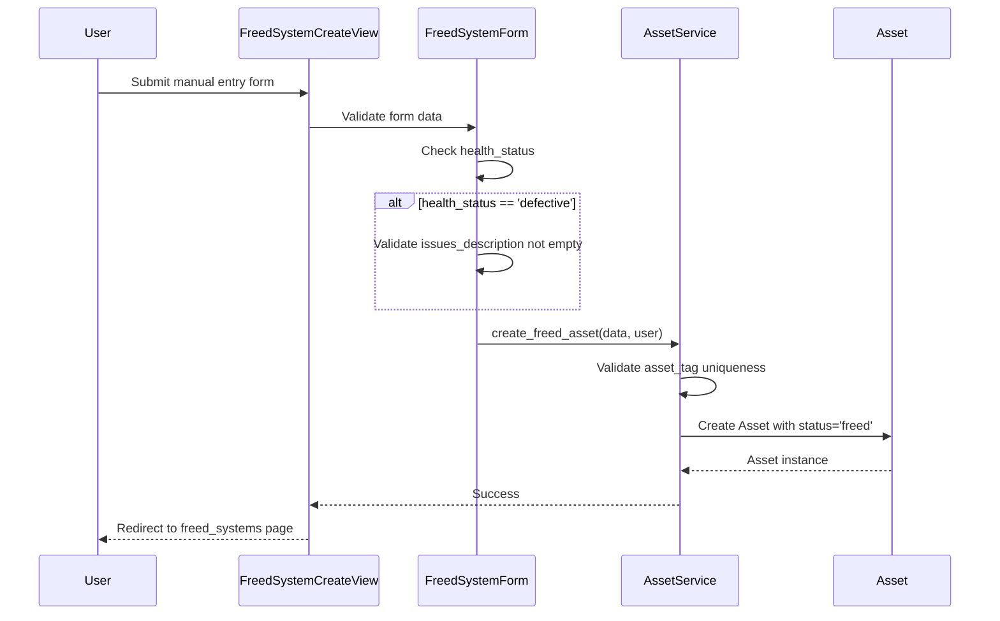
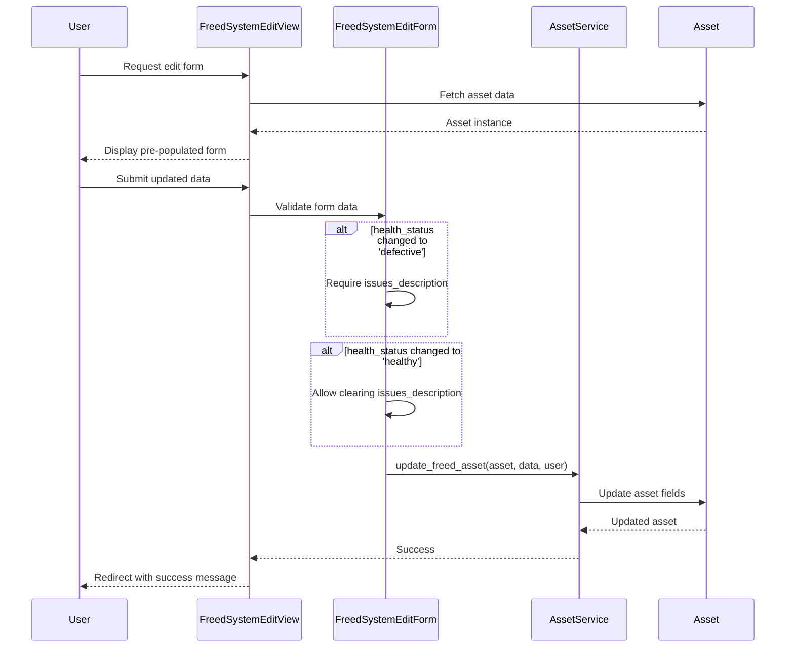

# Design Document: Freed Systems Health Tracking

## Overview

This feature enhances the Django Asset Tracker's Freed Systems functionality by adding two key capabilities:

1. **Manual Entry**: Direct creation of freed systems without requiring a pre-existing active asset
2. **Health Status Tracking**: Classification of freed systems as "healthy" (operational) or "defective" (non-operational) with issue descriptions

The design extends the existing Asset model, adds new forms and views, and updates the AssetService to handle health status validation. The freed_systems.html template will be enhanced to display health indicators and issue descriptions.

### Design Goals

- Maintain backward compatibility with existing asset freeing workflow
- Provide clear visual indicators for system health status
- Enforce validation rules for defective systems requiring issue descriptions
- Reuse existing Django patterns and components from the codebase

## Architecture

### Component Overview

The feature follows Django's MVT (Model-View-Template) architecture with a service layer:

```
┌─────────────────────────────────────────────────────────────┐
│                         Presentation Layer                   │
│  ┌──────────────────┐  ┌──────────────────────────────────┐ │
│  │ freed_systems.   │  │ freed_system_create.html         │ │
│  │ html (updated)   │  │ freed_system_edit.html           │ │
│  └──────────────────┘  └──────────────────────────────────┘ │
└─────────────────────────────────────────────────────────────┘
                              │
                              ▼
┌─────────────────────────────────────────────────────────────┐
│                          View Layer                          │
│  ┌──────────────────┐  ┌──────────────────────────────────┐ │
│  │ FreeSystemsView  │  │ FreedSystemCreateView            │ │
│  │ (updated)        │  │ FreedSystemEditView              │ │
│  └──────────────────┘  └──────────────────────────────────┘ │
└─────────────────────────────────────────────────────────────┘
                              │
                              ▼
┌─────────────────────────────────────────────────────────────┐
│                         Form Layer                           │
│  ┌──────────────────┐  ┌──────────────────────────────────┐ │
│  │ FreedSystemForm  │  │ FreedSystemEditForm              │ │
│  └──────────────────┘  └──────────────────────────────────┘ │
└─────────────────────────────────────────────────────────────┘
                              │
                              ▼
┌─────────────────────────────────────────────────────────────┐
│                        Service Layer                         │
│  ┌────────────────────────────────────────────────────────┐ │
│  │ AssetService (updated)                                 │ │
│  │ - create_freed_asset()                                 │ │
│  │ - update_freed_asset()                                 │ │
│  │ - free_asset() [updated with health_status default]   │ │
│  └────────────────────────────────────────────────────────┘ │
└─────────────────────────────────────────────────────────────┘
                              │
                              ▼
┌─────────────────────────────────────────────────────────────┐
│                         Model Layer                          │
│  ┌────────────────────────────────────────────────────────┐ │
│  │ Asset (updated)                                        │ │
│  │ + health_status: CharField                             │ │
│  │ + issues_description: TextField                        │ │
│  └────────────────────────────────────────────────────────┘ │
└─────────────────────────────────────────────────────────────┘
```

### Workflow Diagrams

#### Manual Freed System Creation Flow



#### Health Status Update Flow



## Components and Interfaces

### 1. Model Changes

#### Asset Model Extensions

Add two new fields to the existing Asset model:

```python
class Asset(models.Model):
    # ... existing fields ...
    
    HEALTH_STATUS_CHOICES = [
        ('healthy', 'Healthy'),
        ('defective', 'Defective'),
    ]
    
    health_status = models.CharField(
        max_length=20,
        choices=HEALTH_STATUS_CHOICES,
        null=True,
        blank=True,
        help_text="Health status for freed systems"
    )
    
    issues_description = models.TextField(
        blank=True,
        null=True,
        help_text="Description of issues for defective freed systems"
    )
```

**Field Specifications:**
- `health_status`: Optional field (null=True, blank=True) to maintain backward compatibility with existing freed assets
- `issues_description`: Optional text field for storing issue details
- Both fields are only relevant when status='freed'

### 2. Forms

#### FreedSystemForm (New)

Form for manually creating freed systems:

```python
class FreedSystemForm(forms.ModelForm):
    class Meta:
        model = Asset
        fields = ['asset_tag', 'system_type', 'operating_system', 
                  'ip_address', 'manual_ip', 'health_status', 
                  'issues_description', 'manufacturer', 'particulars']
    
    def __init__(self, *args, **kwargs):
        super().__init__(*args, **kwargs)
        self.fields['health_status'].required = True
        # Set up field widgets and help text
    
    def clean(self):
        cleaned_data = super().clean()
        health_status = cleaned_data.get('health_status')
        issues_description = cleaned_data.get('issues_description')
        
        # Validate issues_description required for defective systems
        if health_status == 'defective' and not issues_description:
            raise ValidationError({
                'issues_description': 'Issue description is required for defective systems.'
            })
        
        return cleaned_data
```

**Key Features:**
- Inherits from ModelForm for automatic field generation
- Makes health_status required for manual entry
- Custom clean() method enforces conditional validation
- Reuses existing field types (asset_tag, system_type, etc.)

#### FreedSystemEditForm (New)

Form for editing freed system health status:

```python
class FreedSystemEditForm(forms.ModelForm):
    class Meta:
        model = Asset
        fields = ['health_status', 'issues_description', 'particulars']
    
    def __init__(self, *args, **kwargs):
        super().__init__(*args, **kwargs)
        self.fields['health_status'].required = True
    
    def clean(self):
        cleaned_data = super().clean()
        health_status = cleaned_data.get('health_status')
        issues_description = cleaned_data.get('issues_description')
        
        if health_status == 'defective' and not issues_description:
            raise ValidationError({
                'issues_description': 'Issue description is required for defective systems.'
            })
        
        return cleaned_data
```

**Key Features:**
- Limited field set focused on health status updates
- Same validation logic as FreedSystemForm
- Allows updating particulars for additional notes

### 3. Views

#### FreedSystemCreateView (New)

Class-based view for manual freed system creation:

```python
class FreedSystemCreateView(LoginRequiredMixin, UserPassesTestMixin, CreateView):
    model = Asset
    form_class = FreedSystemForm
    template_name = 'assets/freed_system_create.html'
    success_url = reverse_lazy('freed_systems')
    
    def test_func(self):
        return self.request.user.is_staff
    
    def form_valid(self, form):
        try:
            asset = AssetService.create_freed_asset(
                form.cleaned_data,
                self.request.user
            )
            messages.success(
                self.request,
                f'Freed system {asset.asset_tag} created successfully.'
            )
            return redirect(self.success_url)
        except ValidationError as e:
            form.add_error(None, e)
            return self.form_invalid(form)
```

**Key Features:**
- Requires staff permissions (UserPassesTestMixin)
- Delegates business logic to AssetService
- Provides user feedback via Django messages
- Handles validation errors gracefully

#### FreedSystemEditView (New)

Class-based view for editing freed system health status:

```python
class FreedSystemEditView(LoginRequiredMixin, UserPassesTestMixin, UpdateView):
    model = Asset
    form_class = FreedSystemEditForm
    template_name = 'assets/freed_system_edit.html'
    success_url = reverse_lazy('freed_systems')
    
    def test_func(self):
        return self.request.user.is_staff
    
    def get_queryset(self):
        return Asset.objects.filter(status='freed')
    
    def form_valid(self, form):
        try:
            asset = AssetService.update_freed_asset(
                self.object,
                form.cleaned_data,
                self.request.user
            )
            messages.success(
                self.request,
                f'Freed system {asset.asset_tag} updated successfully.'
            )
            return redirect(self.success_url)
        except ValidationError as e:
            form.add_error(None, e)
            return self.form_invalid(form)
```

**Key Features:**
- Restricts queryset to freed assets only
- Reuses AssetService for consistency
- Maintains audit trail through service layer

#### FreeSystemsView (Updated)

Update existing view to pass health status data to template:

```python
class FreeSystemsView(LoginRequiredMixin, ListView):
    model = Asset
    template_name = 'assets/freed_systems.html'
    context_object_name = 'freed_assets'
    
    def get_queryset(self):
        return Asset.objects.filter(status='freed').select_related(
            'operating_system', 'ip_address'
        ).order_by('-freed_date')
```

**Changes:**
- No code changes required
- Template will access new health_status and issues_description fields directly

### 4. Service Layer

#### AssetService Updates

Add new methods and update existing free_asset method:

```python
class AssetService:
    # ... existing methods ...
    
    @staticmethod
    def create_freed_asset(data, user):
        """
        Create a new freed system directly without requiring an active asset.
        
        Args:
            data: Dictionary containing asset fields
            user: User creating the asset
            
        Returns:
            Asset: Created asset instance
            
        Raises:
            ValidationError: If validation fails
        """
        # Validate asset_tag uniqueness
        if Asset.objects.filter(asset_tag=data['asset_tag']).exists():
            raise ValidationError({'asset_tag': 'Asset tag already exists.'})
        
        # Create asset with freed status
        asset = Asset.objects.create(
            asset_tag=data['asset_tag'],
            system_type=data['system_type'],
            operating_system=data['operating_system'],
            ip_address=data.get('ip_address'),
            manual_ip=data.get('manual_ip'),
            manufacturer=data.get('manufacturer'),
            particulars=data.get('particulars'),
            health_status=data['health_status'],
            issues_description=data.get('issues_description'),
            status='freed',
            freed_date=timezone.now(),
            assigned_to=None,
            team=None
        )
        
        return asset
    
    @staticmethod
    def update_freed_asset(asset, data, user):
        """
        Update health status and issues for a freed system.
        
        Args:
            asset: Asset instance to update
            data: Dictionary containing updated fields
            user: User performing the update
            
        Returns:
            Asset: Updated asset instance
            
        Raises:
            ValidationError: If asset is not freed or validation fails
        """
        if asset.status != 'freed':
            raise ValidationError('Only freed assets can be updated with this method.')
        
        # Update fields
        asset.health_status = data['health_status']
        asset.issues_description = data.get('issues_description')
        asset.particulars = data.get('particulars')
        asset.save()
        
        return asset
    
    @staticmethod
    def free_asset(asset, user, password):
        """
        Free an active asset (existing method - updated).
        
        Updates:
        - Set health_status to 'healthy' by default when freeing an asset
        """
        # ... existing validation and password check ...
        
        # Update asset status
        asset.status = 'freed'
        asset.freed_date = timezone.now()
        asset.assigned_to = None
        asset.team = None
        asset.health_status = 'healthy'  # NEW: Set default health status
        asset.issues_description = None  # NEW: Clear any existing issues
        
        # ... existing IP address handling ...
        
        asset.save()
        return asset
```

**Key Design Decisions:**
- `create_freed_asset()`: New method for manual entry workflow
- `update_freed_asset()`: Dedicated method for health status updates
- `free_asset()`: Updated to set default health_status='healthy'
- All methods maintain consistent validation and error handling patterns

### 5. Templates

#### freed_system_create.html (New)

Template for manual freed system creation form:

```html


Add Freed System - Asset Tracker


<h1>Add Freed System</h1>

<form method="post">
    
    {{ form.as_p }}
    <button type="submit" class="btn btn-primary">Create Freed System</button>
    <a href="" class="btn btn-secondary">Cancel</a>
</form>

```

#### freed_system_edit.html (New)

Template for editing freed system health status:

```html


Edit Freed System - Asset Tracker


<h1>Edit Freed System: {{ asset.asset_tag }}</h1>

<form method="post">
    
    {{ form.as_p }}
    <button type="submit" class="btn btn-primary">Update</button>
    <a href="" class="btn btn-secondary">Cancel</a>
</form>

```

#### freed_systems.html (Updated)

Update existing template to display health status and issues:

```html


Free Systems - Asset Tracker


<div class="header-actions">
    <h1>Free Systems</h1>
    <div>
        
        <a href="" class="btn btn-primary">Add Freed System</a>
        
        <a href="" class="btn btn-success">Export to Excel</a>
    </div>
</div>


    
        <div class="alert alert-{{ message.tags }}">
            {{ message }}
        </div>
    



<div class="table-responsive">
    <table>
        <thead>
            <tr>
                <th>Asset Tag</th>
                <th>IP Address</th>
                <th>System Type</th>
                <th>Operating System</th>
                <th>Health Status</th>
                <th>Issues</th>
                <th>Freed Date</th>
                
                <th>Actions</th>
                
            </tr>
        </thead>
        <tbody>
            
            <tr>
                <td>{{ asset.asset_tag }}</td>
                <td>{{ asset.ip_address.address|default:"N/A" }}</td>
                <td>{{ asset.system_type }}</td>
                <td>{{ asset.operating_system.name }}</td>
                <td>
                    
                        <span class="badge badge-success">✓ Healthy</span>
                    
                        <span class="badge badge-danger">⚠ Defective</span>
                    
                        <span class="badge badge-secondary">N/A</span>
                    
                </td>
                <td>
                    
                        {{ asset.issues_description|truncatewords:10 }}
                    
                        -
                    
                </td>
                <td>{{ asset.freed_date|date:"Y-m-d H:i" }}</td>
                
                <td>
                    <a href="" class="btn btn-sm btn-primary">Edit</a>
                    <a href="" class="btn btn-sm btn-danger">Scrap</a>
                </td>
                
            </tr>
            
        </tbody>
    </table>
</div>

<div class="alert alert-info">
    <p>No freed systems found.</p>
</div>


```

**Template Updates:**
- Add "Add Freed System" button for staff users
- Add Health Status column with color-coded badges
- Add Issues column showing truncated issue descriptions
- Add Edit action button for updating health status
- Use Bootstrap badge classes for visual indicators

### 6. URL Configuration

Add new URL patterns to assets/urls.py:

```python
urlpatterns = [
    # ... existing patterns ...
    path('freed/create/', FreedSystemCreateView.as_view(), name='freed_system_create'),
    path('freed/<int:pk>/edit/', FreedSystemEditView.as_view(), name='freed_system_edit'),
]
```

## Data Models

### Asset Model Schema

Updated Asset model with new fields:

| Field Name | Type | Constraints | Description |
|------------|------|-------------|-------------|
| serial_number | AutoField | Primary Key | Auto-incrementing ID |
| asset_tag | CharField(50) | Unique, Indexed | Asset identifier (BIDC + number) |
| system_type | CharField(20) | Choices | Desktop/Laptop/All-in-One PC |
| hardware_serial_number | CharField(100) | Nullable | Hardware serial number |
| operating_system | ForeignKey | PROTECT | Reference to OperatingSystem |
| ip_address | ForeignKey | SET_NULL, Nullable | Reference to IPAddress |
| manual_ip | GenericIPAddressField | Nullable | Manually entered IP |
| particulars | TextField | Nullable | Detailed information |
| assigned_to | CharField(100) | Nullable | User assignment |
| team | ForeignKey | SET_NULL, Nullable | Team assignment |
| status | CharField(20) | Choices, Indexed, Default='active' | active/freed/scrapped |
| warranty_expiration | DateField | Nullable, Indexed | Warranty end date |
| freed_date | DateTimeField | Nullable | When asset was freed |
| scrapped_date | DateTimeField | Nullable | When asset was scrapped |
| manufacturer | CharField(100) | Nullable | Manufacturer/brand |
| scrapping_reason | TextField | Nullable | Reason for scrapping |
| **health_status** | **CharField(20)** | **Choices, Nullable** | **healthy/defective** |
| **issues_description** | **TextField** | **Nullable** | **Issue details for defective systems** |
| created_at | DateTimeField | Auto-add | Creation timestamp |
| updated_at | DateTimeField | Auto-update | Last update timestamp |

**New Fields (highlighted):**
- `health_status`: Tracks operational status of freed systems
- `issues_description`: Stores problem descriptions for defective systems

### Database Migration

Migration will add two new nullable fields:

```python
# Generated migration file
class Migration(migrations.Migration):
    dependencies = [
        ('assets', 'XXXX_previous_migration'),
    ]
    
    operations = [
        migrations.AddField(
            model_name='asset',
            name='health_status',
            field=models.CharField(
                blank=True,
                choices=[('healthy', 'Healthy'), ('defective', 'Defective')],
                help_text='Health status for freed systems',
                max_length=20,
                null=True
            ),
        ),
        migrations.AddField(
            model_name='asset',
            name='issues_description',
            field=models.TextField(
                blank=True,
                help_text='Description of issues for defective freed systems',
                null=True
            ),
        ),
    ]
```

**Migration Strategy:**
- Fields are nullable to maintain backward compatibility
- Existing freed assets will have health_status=NULL initially
- No data migration needed (NULL is acceptable for existing records)
- Future freed assets will have health_status populated


## Correctness Properties

*A property is a characteristic or behavior that should hold true across all valid executions of a system—essentially, a formal statement about what the system should do. Properties serve as the bridge between human-readable specifications and machine-verifiable correctness guarantees.*

### Property 1: Manual Entry Creates Freed Asset with Correct State

*For any* valid manual entry form data (asset_tag, system_type, operating_system, health_status), when the form is submitted, the created asset should have status='freed', freed_date set to the current timestamp (within 1 second), assigned_to=NULL, and team=NULL.

**Validates: Requirements 1.2, 1.3**

### Property 2: Duplicate Asset Tag Rejection

*For any* asset_tag that already exists in the database, attempting to create a new freed system with that asset_tag should result in a validation error.

**Validates: Requirements 1.4**

### Property 3: Missing Required Fields Validation

*For any* manual entry form submission with one or more required fields (asset_tag, system_type, operating_system, health_status) missing, the form validation should fail and return errors for each missing field.

**Validates: Requirements 1.5**

### Property 4: Health Status Required for Manual Entry

*For any* manual entry form submission without a health_status value, the form validation should fail with an error indicating health_status is required.

**Validates: Requirements 2.2**

### Property 5: Free Asset Sets Healthy Default

*For any* active asset, when freed through the existing free_asset operation with valid password, the resulting asset should have status='freed', health_status='healthy', issues_description=NULL, assigned_to=NULL, team=NULL, and freed_date set to the current timestamp.

**Validates: Requirements 2.3, 4.1, 4.2**

### Property 6: Defective Systems Require Issues Description

*For any* form submission (create or edit) where health_status='defective' and issues_description is empty or NULL, the form validation should fail with an error indicating issues_description is required.

**Validates: Requirements 3.2, 3.4**

### Property 7: Healthy Systems Allow Empty Issues

*For any* form submission (create or edit) where health_status='healthy', the form validation should succeed regardless of whether issues_description is empty, NULL, or populated.

**Validates: Requirements 3.3**

### Property 8: Freed Systems Page Displays All Required Fields

*For any* freed asset, the rendered freed_systems.html page should contain the asset's asset_tag, system_type, operating_system name, IP address (or "N/A"), health_status, and freed_date in the HTML output.

**Validates: Requirements 2.4, 4.5**

### Property 9: Defective Systems Display Issues

*For any* freed asset with health_status='defective' and a non-empty issues_description, the rendered freed_systems.html page should display the issues_description text.

**Validates: Requirements 3.5**

### Property 10: Healthy Systems Hide Issues

*For any* freed asset with health_status='healthy', the rendered freed_systems.html page should not display the issues_description field (should show "-" or empty cell).

**Validates: Requirements 3.6**

### Property 11: Password Required for Freeing Assets

*For any* active asset, attempting to free it through the free_asset operation without providing a valid password should result in a validation error and the asset should remain in 'active' status.

**Validates: Requirements 4.3**

### Property 12: Both Manual and Freed Assets Displayed

*For any* combination of manually created freed systems and assets freed from active inventory, the freed_systems page queryset should include both types of freed assets.

**Validates: Requirements 4.4**

### Property 13: Edit Action Available for All Freed Systems

*For any* freed asset displayed on the freed_systems page when viewed by a staff user, the rendered HTML should contain an edit link/button for that asset.

**Validates: Requirements 5.1**

### Property 14: Edit Form Pre-populated with Current Data

*For any* freed asset, when the edit view is accessed, the form should be initialized with the asset's current health_status, issues_description, and particulars values.

**Validates: Requirements 5.2**

### Property 15: Edit Form Enforces Conditional Validation

*For any* freed asset being edited, if health_status is changed to 'defective', issues_description must be provided; if changed to 'healthy', issues_description may be cleared. The form validation should enforce these rules.

**Validates: Requirements 5.3, 5.4**

### Property 16: Valid Edit Updates Asset

*For any* freed asset and valid edit form data, when the edit form is submitted, the asset's health_status, issues_description, and particulars fields should be updated to match the submitted values.

**Validates: Requirements 5.5**

## Error Handling

### Validation Errors

The system handles validation errors at multiple layers:

1. **Form Layer Validation**
   - Field-level validation (required fields, field types)
   - Cross-field validation (health_status + issues_description dependency)
   - Django's built-in form validation framework
   - Custom clean() methods for conditional logic

2. **Service Layer Validation**
   - Business rule enforcement (duplicate asset_tag)
   - Status validation (only freed assets can be edited with FreedSystemEditView)
   - Password verification for free_asset operation
   - Raises ValidationError with descriptive messages

3. **Model Layer Validation**
   - Database constraints (unique asset_tag)
   - Foreign key integrity (operating_system, team, ip_address)
   - Field choices enforcement (health_status, status, system_type)

### Error Response Patterns

**Form Validation Errors:**
```python
# Example error response
{
    'issues_description': ['Issue description is required for defective systems.'],
    'asset_tag': ['Asset tag already exists.']
}
```

**Service Layer Errors:**
```python
# Raised as ValidationError
raise ValidationError({
    'asset_tag': 'Asset tag already exists.'
})
```

**User Feedback:**
- Form errors displayed inline with form fields
- Django messages framework for success/error notifications
- HTTP 400 for validation errors
- HTTP 403 for permission errors (non-staff users)
- HTTP 404 for non-existent assets

### Edge Cases

1. **Existing Freed Assets Without Health Status**
   - Legacy freed assets may have health_status=NULL
   - UI displays "N/A" badge for NULL health_status
   - Edit form allows setting health_status for the first time

2. **Concurrent Asset Tag Creation**
   - Database unique constraint prevents duplicates
   - IntegrityError caught and converted to ValidationError
   - User sees friendly error message

3. **IP Address Handling**
   - Both managed (IPAddress FK) and manual_ip supported
   - Display logic: show ip_address.address if exists, else manual_ip, else "N/A"
   - Freed assets may have no IP address

4. **Empty Issues Description**
   - NULL and empty string treated equivalently
   - Validation checks: `not issues_description` (catches both)
   - Database stores NULL for empty values

## Testing Strategy

### Dual Testing Approach

This feature requires both unit tests and property-based tests for comprehensive coverage:

**Unit Tests** focus on:
- Specific examples of form submissions
- Edge cases (NULL health_status, empty strings)
- Integration between views and services
- Template rendering with specific data
- Error message content and formatting

**Property-Based Tests** focus on:
- Universal properties across all valid inputs
- Validation rules that should hold for any data
- State transitions (active → freed, healthy → defective)
- Invariants (freed assets always have NULL assigned_to/team)

### Property-Based Testing Configuration

**Framework:** Use `hypothesis` for Python/Django property-based testing

**Configuration:**
- Minimum 100 iterations per property test
- Each test tagged with feature name and property number
- Tag format: `# Feature: freed-systems-health-tracking, Property {N}: {property_text}`

**Example Property Test Structure:**

```python
from hypothesis import given, strategies as st
from hypothesis.extra.django import from_model
import pytest

@pytest.mark.django_db
@given(
    asset_tag=st.text(min_size=1, max_size=50),
    system_type=st.sampled_from(['Desktop', 'Laptop', 'All-in-One PC']),
    health_status=st.sampled_from(['healthy', 'defective'])
)
def test_property_1_manual_entry_creates_freed_asset(
    asset_tag, system_type, health_status, operating_system_factory
):
    """
    Feature: freed-systems-health-tracking, Property 1: 
    Manual Entry Creates Freed Asset with Correct State
    """
    # Test implementation
    pass
```

### Test Coverage Requirements

**Model Tests:**
- Health status field choices validation
- Issues description field accepts text
- NULL values handled correctly for both new fields

**Form Tests:**
- FreedSystemForm validates required fields
- FreedSystemForm enforces defective → issues_description rule
- FreedSystemForm allows healthy with empty issues
- FreedSystemEditForm has same validation logic
- Form field initialization and widgets

**Service Tests:**
- create_freed_asset() creates asset with correct status
- create_freed_asset() rejects duplicate asset_tag
- update_freed_asset() only works on freed assets
- free_asset() sets health_status='healthy' by default
- Password validation in free_asset()

**View Tests:**
- FreedSystemCreateView requires staff permission
- FreedSystemCreateView redirects on success
- FreedSystemEditView restricts to freed assets
- FreedSystemEditView pre-populates form
- FreeSystemsView displays all freed assets

**Template Tests:**
- freed_systems.html displays health status badges
- freed_systems.html shows issues for defective systems
- freed_systems.html hides issues for healthy systems
- freed_systems.html includes edit and scrap buttons for staff
- freed_system_create.html renders form correctly
- freed_system_edit.html renders form correctly

**Integration Tests:**
- End-to-end manual entry workflow
- End-to-end edit workflow
- End-to-end free_asset workflow with health_status
- Both manual and freed assets appear together

### Property Test Examples

Each correctness property should have a corresponding property-based test:

1. **Property 1:** Generate random valid form data, verify created asset state
2. **Property 2:** Generate existing asset_tag, verify rejection
3. **Property 3:** Generate data with random missing fields, verify errors
4. **Property 6:** Generate defective status with empty issues, verify rejection
5. **Property 7:** Generate healthy status with various issues values, verify acceptance
6. **Property 11:** Generate random passwords (valid/invalid), verify behavior
7. **Property 16:** Generate random valid edit data, verify updates applied

### Test Data Strategies

**Hypothesis Strategies:**
- `asset_tag`: Text with constraints (1-50 chars, alphanumeric + special chars)
- `system_type`: Sampled from SYSTEM_TYPE_CHOICES
- `health_status`: Sampled from HEALTH_STATUS_CHOICES
- `issues_description`: Text (0-1000 chars) or None
- `operating_system`: from_model(OperatingSystem)
- `ip_address`: IPv4 addresses or None

**Fixtures:**
- `operating_system_factory`: Creates OperatingSystem instances
- `team_factory`: Creates Team instances
- `active_asset_factory`: Creates active assets for freeing
- `freed_asset_factory`: Creates freed assets for editing
- `staff_user`: User with is_staff=True
- `regular_user`: User with is_staff=False

### Migration Testing

**Test Migration:**
- Run migration on test database
- Verify health_status field exists with correct choices
- Verify issues_description field exists as TextField
- Verify existing freed assets remain valid (NULL values accepted)
- Verify new freed assets can be created with health_status

**Rollback Testing:**
- Verify migration can be rolled back cleanly
- Verify data integrity after rollback
