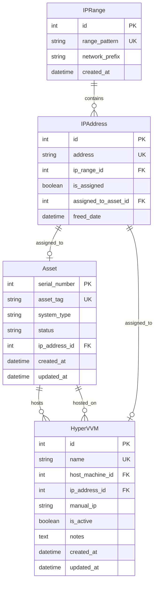

# Design Document: Hyper-V VM Tracking

## Overview

This feature extends the Django Asset Tracker to support tracking Hyper-V virtual machines (VMs) and their relationships to physical host machines. The design introduces a new `HyperVVM` model that maintains bidirectional relationships with the existing `Asset` model, integrates with the IP management system, and provides dedicated UI components for VM management.

The system will track VM details (name, IP address), link VMs to their physical hosts, display bidirectional relationships in both detail views and IP list pages, and apply IP range-specific UI behavior to reflect actual VM usage patterns across different network segments.

Key design principles:
- Maintain data integrity through foreign key relationships and validation
- Reuse existing IP management infrastructure
- Provide intuitive bidirectional navigation between VMs and hosts
- Apply range-specific UI patterns to match operational reality

## Architecture

### Component Structure

```
assets/
├── models.py                    # Add HyperVVM model
├── forms/
│   └── hyperv_forms.py         # New: VM creation/edit forms
├── views.py                     # Add VM CRUD views
├── services/
│   ├── hyperv_service.py       # New: VM business logic
│   └── ip_management_service.py # Extend: VM IP tracking
├── templates/assets/
│   ├── hyperv_vm_list.html     # New: VM list view
│   ├── hyperv_vm_form.html     # New: VM create/edit form
│   ├── hyperv_vm_detail.html   # New: VM detail view
│   └── free_ips.html           # Extend: Add VM relationships
└── urls.py                      # Add VM routes
```

### Data Flow

1. **VM Creation Flow**:
   - User accesses dedicated VM entry form
   - Form displays available host machine IPs for selection
   - User enters VM name and selects host by IP
   - User optionally assigns VM IP address
   - HyperVService validates data and creates VM record
   - IPManagementService marks VM IP as occupied
   - System establishes bidirectional relationship

2. **Relationship Display Flow**:
   - User views host machine detail page
   - System queries all VMs linked to host
   - Template displays VM list with names and IPs
   - User clicks VM link to navigate to VM detail
   - VM detail page shows host machine information
   - User can navigate back to host via link

3. **IP List Integration Flow**:
   - User views IP list page
   - System queries all IPs with relationships
   - For host IPs: display all hosted VM IPs
   - For VM IPs: display host machine IP
   - Provide clickable links between related IPs

## Components and Interfaces

### Models

#### HyperVVM Model

```python
class HyperVVM(models.Model):
    """Model for tracking Hyper-V virtual machines."""
    
    name = models.CharField(max_length=200, unique=True, db_index=True)
    host_machine = models.ForeignKey(
        Asset,
        on_delete=models.PROTECT,
        related_name='hosted_vms',
        help_text="Physical machine hosting this VM"
    )
    ip_address = models.ForeignKey(
        IPAddress,
        on_delete=models.SET_NULL,
        null=True,
        blank=True,
        related_name='vm'
    )
    manual_ip = models.GenericIPAddressField(
        protocol='IPv4',
        null=True,
        blank=True,
        help_text="Manually entered IP (not tracked in IP management)"
    )
    is_active = models.BooleanField(default=True, db_index=True)
    notes = models.TextField(blank=True, null=True)
    created_at = models.DateTimeField(auto_now_add=True)
    updated_at = models.DateTimeField(auto_now=True)
    
    class Meta:
        ordering = ['name']
        verbose_name = 'Hyper-V VM'
        verbose_name_plural = 'Hyper-V VMs'
        indexes = [
            models.Index(fields=['host_machine', 'is_active']),
            models.Index(fields=['ip_address']),
        ]
    
    def __str__(self):
        return f"{self.name} (on {self.host_machine.asset_tag})"
    
    def clean(self):
        """Validate VM data."""
        from django.core.exceptions import ValidationError
        
        # Prevent circular relationships (VM cannot host itself)
        if hasattr(self, 'host_machine') and self.host_machine:
            # Check if host_machine is actually a VM
            # (This prevents complex circular scenarios)
            pass
        
        # Validate IP uniqueness if provided
        if self.ip_address:
            existing = HyperVVM.objects.filter(
                ip_address=self.ip_address
            ).exclude(pk=self.pk)
            if existing.exists():
                raise ValidationError({
                    'ip_address': 'This IP address is already assigned to another VM.'
                })
    
    def get_display_ip(self):
        """Return the IP address to display (tracked or manual)."""
        if self.ip_address:
            return self.ip_address.address
        return self.manual_ip or 'No IP assigned'
    
    def get_host_ip(self):
        """Return the host machine's IP address."""
        if self.host_machine.ip_address:
            return self.host_machine.ip_address.address
        return self.host_machine.manual_ip or 'No IP'
```

#### IPAddress Model Extension

The existing `IPAddress` model already supports the relationship through the `related_name='vm'` in the HyperVVM model. No changes needed to the IPAddress model itself.

#### Asset Model Extension

The `Asset` model gains a reverse relationship `hosted_vms` through the ForeignKey in HyperVVM. No direct changes needed to the Asset model.

### Forms

#### HyperVVMForm

```python
class HyperVVMForm(forms.ModelForm):
    """Form for creating and editing Hyper-V VMs."""
    
    host_machine_ip = forms.ModelChoiceField(
        queryset=Asset.objects.filter(
            status='active',
            ip_address__isnull=False
        ).select_related('ip_address'),
        required=True,
        empty_label="Select Host Machine by IP",
        label='Host Machine IP Address',
        widget=forms.Select(attrs={'class': 'form-control'}),
        help_text='Select the physical machine that hosts this VM'
    )
    
    class Meta:
        model = HyperVVM
        fields = ['name', 'ip_address', 'notes']
        widgets = {
            'name': forms.TextInput(attrs={
                'class': 'form-control',
                'placeholder': 'e.g., VM-WebServer-01'
            }),
            'ip_address': forms.Select(attrs={'class': 'form-control'}),
            'notes': forms.Textarea(attrs={
                'class': 'form-control',
                'rows': 4,
                'placeholder': 'Additional notes about this VM'
            }),
        }
    
    def __init__(self, *args, **kwargs):
        super().__init__(*args, **kwargs)
        
        # Populate IP address dropdown with available IPs
        if self.instance and self.instance.pk and self.instance.ip_address:
            available_ips = IPAddress.objects.filter(
                models.Q(is_assigned=False) | models.Q(pk=self.instance.ip_address.pk)
            )
        else:
            available_ips = IPAddress.objects.filter(is_assigned=False)
        
        self.fields['ip_address'].queryset = available_ips
        self.fields['ip_address'].empty_label = "Select IP Address"
        self.fields['ip_address'].required = False
        
        # Set initial host_machine_ip for edit mode
        if self.instance and self.instance.pk:
            self.fields['host_machine_ip'].initial = self.instance.host_machine
    
    def label_from_instance(self, obj):
        """Custom label for host machine dropdown showing IP."""
        if obj.ip_address:
            return f"{obj.ip_address.address} - {obj.asset_tag}"
        return f"{obj.asset_tag} (No IP)"
    
    def clean(self):
        cleaned_data = super().clean()
        host_machine_ip = cleaned_data.get('host_machine_ip')
        
        # Set host_machine from host_machine_ip selection
        if host_machine_ip:
            cleaned_data['host_machine'] = host_machine_ip
        
        return cleaned_data
```

### Views

#### HyperVVMListView

```python
class HyperVVMListView(LoginRequiredMixin, ListView):
    """Display all Hyper-V VMs."""
    model = HyperVVM
    template_name = 'assets/hyperv_vm_list.html'
    context_object_name = 'vms'
    login_url = '/login/'
    
    def get_queryset(self):
        """Return active VMs with related data."""
        return HyperVVM.objects.filter(
            is_active=True
        ).select_related(
            'host_machine',
            'host_machine__ip_address',
            'ip_address'
        ).order_by('name')
```

#### HyperVVMCreateView

```python
class HyperVVMCreateView(AdminRequiredMixin, CreateView):
    """Handle VM creation (admin only)."""
    model = HyperVVM
    form_class = HyperVVMForm
    template_name = 'assets/hyperv_vm_form.html'
    success_url = reverse_lazy('hyperv_vm_list')
    
    def form_valid(self, form):
        try:
            vm = HyperVService.create_vm(
                form.cleaned_data,
                self.request.user
            )
            messages.success(
                self.request,
                f'VM {vm.name} created successfully.'
            )
            return redirect(self.success_url)
        except ValidationError as e:
            # Handle validation errors
            return self.form_invalid(form)
```

#### HyperVVMUpdateView

```python
class HyperVVMUpdateView(AdminRequiredMixin, UpdateView):
    """Handle VM updates (admin only)."""
    model = HyperVVM
    form_class = HyperVVMForm
    template_name = 'assets/hyperv_vm_form.html'
    success_url = reverse_lazy('hyperv_vm_list')
    
    def form_valid(self, form):
        try:
            vm = HyperVService.update_vm(
                self.get_object(),
                form.cleaned_data,
                self.request.user
            )
            messages.success(
                self.request,
                f'VM {vm.name} updated successfully.'
            )
            return redirect(self.success_url)
        except ValidationError as e:
            return self.form_invalid(form)
```

#### HyperVVMDetailView

```python
class HyperVVMDetailView(LoginRequiredMixin, DetailView):
    """Display VM details with host machine information."""
    model = HyperVVM
    template_name = 'assets/hyperv_vm_detail.html'
    context_object_name = 'vm'
    login_url = '/login/'
    
    def get_queryset(self):
        return HyperVVM.objects.select_related(
            'host_machine',
            'host_machine__ip_address',
            'ip_address'
        )
```

#### HyperVVMDeleteView

```python
class HyperVVMDeleteView(AdminRequiredMixin, DeleteView):
    """Handle VM deletion (admin only)."""
    model = HyperVVM
    template_name = 'assets/hyperv_vm_confirm_delete.html'
    success_url = reverse_lazy('hyperv_vm_list')
    
    def delete(self, request, *args, **kwargs):
        vm = self.get_object()
        try:
            HyperVService.delete_vm(vm, request.user)
            messages.success(request, f'VM {vm.name} deleted successfully.')
            return redirect(self.success_url)
        except Exception as e:
            messages.error(request, f'Error deleting VM: {str(e)}')
            return redirect('hyperv_vm_list')
```

### Services

#### HyperVService

```python
class HyperVService:
    """Business logic for Hyper-V VM management."""
    
    @staticmethod
    @transaction.atomic
    def create_vm(data, user):
        """
        Create a new Hyper-V VM.
        
        Args:
            data: Dictionary with VM data
            user: User creating the VM
        
        Returns:
            HyperVVM: Created VM instance
        
        Raises:
            ValidationError: If validation fails
        """
        vm = HyperVVM(
            name=data['name'],
            host_machine=data['host_machine'],
            notes=data.get('notes', '')
        )
        
        # Handle IP assignment
        if data.get('ip_address'):
            vm.ip_address = data['ip_address']
            IPManagementService.assign_ip(data['ip_address'], None)
        
        vm.full_clean()
        vm.save()
        
        return vm
    
    @staticmethod
    @transaction.atomic
    def update_vm(vm, data, user):
        """
        Update an existing Hyper-V VM.
        
        Args:
            vm: HyperVVM instance to update
            data: Dictionary with updated data
            user: User updating the VM
        
        Returns:
            HyperVVM: Updated VM instance
        """
        old_ip = vm.ip_address
        
        vm.name = data['name']
        vm.host_machine = data['host_machine']
        vm.notes = data.get('notes', '')
        
        # Handle IP changes
        new_ip = data.get('ip_address')
        if old_ip != new_ip:
            if old_ip:
                IPManagementService.release_ip(old_ip)
            if new_ip:
                IPManagementService.assign_ip(new_ip, None)
            vm.ip_address = new_ip
        
        vm.full_clean()
        vm.save()
        
        return vm
    
    @staticmethod
    @transaction.atomic
    def delete_vm(vm, user):
        """
        Delete a Hyper-V VM and release its IP.
        
        Args:
            vm: HyperVVM instance to delete
            user: User deleting the VM
        """
        if vm.ip_address:
            IPManagementService.release_ip(vm.ip_address)
        
        vm.delete()
    
    @staticmethod
    def get_vms_for_host(host_asset):
        """
        Get all VMs hosted on a specific asset.
        
        Args:
            host_asset: Asset instance
        
        Returns:
            QuerySet: VMs hosted on this asset
        """
        return HyperVVM.objects.filter(
            host_machine=host_asset,
            is_active=True
        ).select_related('ip_address')
    
    @staticmethod
    def get_host_for_vm_ip(vm_ip_address):
        """
        Get the host machine for a VM IP address.
        
        Args:
            vm_ip_address: IPAddress instance
        
        Returns:
            Asset or None: Host machine if VM exists
        """
        try:
            vm = HyperVVM.objects.select_related('host_machine').get(
                ip_address=vm_ip_address,
                is_active=True
            )
            return vm.host_machine
        except HyperVVM.DoesNotExist:
            return None
```

#### IPManagementService Extension

Extend the existing `IPManagementService` to handle VM IP assignments:

```python
# Add to existing IPManagementService class

@staticmethod
def get_all_ips_by_range_with_vms():
    """
    Return dict of ranges to all IPs with VM relationship data.
    
    Returns:
        dict: IP ranges with IPs including VM relationships
    """
    all_ips = IPAddress.objects.all().select_related(
        'ip_range',
        'assigned_to_asset',
        'vm'
    ).prefetch_related(
        'assigned_to_asset__hosted_vms',
        'assigned_to_asset__hosted_vms__ip_address'
    )
    
    result = {}
    for ip in all_ips:
        range_pattern = ip.ip_range.range_pattern
        if range_pattern not in result:
            result[range_pattern] = []
        
        # Add VM relationship data
        ip_data = {
            'ip': ip,
            'is_vm': hasattr(ip, 'vm') and ip.vm is not None,
            'vm': ip.vm if hasattr(ip, 'vm') else None,
            'hosted_vms': []
        }
        
        # If this IP belongs to a host machine, get its VMs
        if ip.assigned_to_asset:
            ip_data['hosted_vms'] = list(
                ip.assigned_to_asset.hosted_vms.filter(is_active=True)
            )
        
        result[range_pattern].append(ip_data)
    
    # Sort IPs numerically within each range
    for range_pattern in result:
        result[range_pattern] = sorted(
            result[range_pattern],
            key=lambda item: tuple(map(int, item['ip'].address.split('.')))
        )
    
    return result

@staticmethod
def is_common_vm_range(ip_address):
    """
    Check if IP belongs to a common VM range.
    
    Args:
        ip_address: IP address string or IPAddress instance
    
    Returns:
        bool: True if in common VM range (192.168.50.x)
    """
    if isinstance(ip_address, IPAddress):
        address = ip_address.address
    else:
        address = str(ip_address)
    
    return address.startswith('192.168.50.')

@staticmethod
def is_rare_vm_range(ip_address):
    """
    Check if IP belongs to a rare VM range.
    
    Args:
        ip_address: IP address string or IPAddress instance
    
    Returns:
        bool: True if in rare VM range
    """
    if isinstance(ip_address, IPAddress):
        address = ip_address.address
    else:
        address = str(ip_address)
    
    rare_prefixes = ['192.168.10.', '192.168.11.', '192.168.70.']
    return any(address.startswith(prefix) for prefix in rare_prefixes)
```

## Data Models

### Entity Relationship Diagram



### Database Schema

#### HyperVVM Table

| Column | Type | Constraints | Description |
|--------|------|-------------|-------------|
| id | INTEGER | PRIMARY KEY, AUTO_INCREMENT | Unique identifier |
| name | VARCHAR(200) | UNIQUE, NOT NULL, INDEX | VM name |
| host_machine_id | INTEGER | FOREIGN KEY (Asset), NOT NULL, INDEX | Host machine reference |
| ip_address_id | INTEGER | FOREIGN KEY (IPAddress), NULL, INDEX | VM IP address |
| manual_ip | VARCHAR(15) | NULL | Manually entered IP |
| is_active | BOOLEAN | NOT NULL, DEFAULT TRUE, INDEX | Active status |
| notes | TEXT | NULL | Additional notes |
| created_at | DATETIME | NOT NULL, AUTO | Creation timestamp |
| updated_at | DATETIME | NOT NULL, AUTO | Last update timestamp |

**Indexes:**
- `idx_hyperv_vm_name` on (name)
- `idx_hyperv_vm_host_active` on (host_machine_id, is_active)
- `idx_hyperv_vm_ip` on (ip_address_id)

**Foreign Keys:**
- `fk_hyperv_vm_host` FOREIGN KEY (host_machine_id) REFERENCES Asset(serial_number) ON DELETE PROTECT
- `fk_hyperv_vm_ip` FOREIGN KEY (ip_address_id) REFERENCES IPAddress(id) ON DELETE SET NULL

### Data Validation Rules

1. **VM Name Uniqueness**: VM names must be unique across all VMs
2. **Host Machine Validation**: Host machine must be an active Asset
3. **IP Uniqueness**: If IP is assigned, it cannot be used by another VM or Asset
4. **Circular Reference Prevention**: A VM cannot reference itself or create circular host relationships
5. **Host Deletion Protection**: Cannot delete an Asset that hosts active VMs

## Correctness Properties


*A property is a characteristic or behavior that should hold true across all valid executions of a system—essentially, a formal statement about what the system should do. Properties serve as the bridge between human-readable specifications and machine-verifiable correctness guarantees.*

### Property Reflection

After analyzing all acceptance criteria, I identified several areas of redundancy:

1. **Display properties (3.2, 4.1, 4.2)** can be combined into a single property about bidirectional information display
2. **Link properties (3.5, 3.7, 4.3, 4.6, 5.4)** are all about navigation links and can be consolidated
3. **IP list relationship properties (3.6, 4.5, 5.1, 5.2, 5.3)** overlap significantly and can be combined
4. **IP validation properties (8.1, 8.2, 8.3, 8.5)** can be consolidated into comprehensive validation properties
5. **Timestamp properties (9.1, 9.2)** can be combined into a single lifecycle tracking property
6. **Filter properties (10.2, 10.3, 10.4)** can be combined into a general filtering property

### Property 1: VM CRUD Operations

*For any* valid VM data (name, host machine, optional IP), creating a VM through the system should result in a VM record that can be retrieved, updated with new valid data, and deleted, with each operation succeeding without errors.

**Validates: Requirements 1.1, 1.3, 1.4, 1.5, 1.7**

### Property 2: Required Field Validation

*For any* VM creation attempt with missing required fields (name or host machine), the system should reject the creation and return a validation error.

**Validates: Requirements 1.6, 2.1**

### Property 3: Bidirectional VM-Host Relationship

*For any* VM created with a host machine, querying the host should return the VM in its hosted_vms list, and querying the VM should return the correct host machine (round-trip property).

**Validates: Requirements 2.3, 2.6, 3.1**

### Property 4: Host Deletion Protection

*For any* host machine with active VMs, attempting to delete the host should be prevented and return an error.

**Validates: Requirements 2.4**

### Property 5: VM Host Reassignment

*For any* VM and any two different host machines, reassigning the VM from the first host to the second should result in the VM appearing in the second host's VM list and not in the first host's list.

**Validates: Requirements 2.5, 11.1, 11.2**

### Property 6: Bidirectional Information Display

*For any* VM with a host machine, the VM detail page should display the host's name and IP, and the host detail page should display the VM's name and IP.

**Validates: Requirements 3.2, 4.1, 4.2**

### Property 7: Navigation Links Existence

*For any* VM-host relationship, the rendered HTML should contain clickable links in both directions: from host to VM detail, from VM to host detail, and between their IPs in the IP list.

**Validates: Requirements 3.5, 3.7, 4.3, 4.6, 5.4**

### Property 8: IP List Bidirectional Relationships

*For any* host machine with VMs, the IP list page should display all VM IPs under the host IP, and each VM IP should display its host IP, with all relationships being navigable.

**Validates: Requirements 3.6, 4.5, 5.1, 5.2, 5.3, 5.6**

### Property 9: VM IP Occupation Status

*For any* VM assigned an IP address, the IP management system should mark that IP as occupied (is_assigned=True), and when the VM is deleted, the IP should be marked as free (is_assigned=False).

**Validates: Requirements 6.1, 6.4**

### Property 10: VM IP Display Styling

*For any* IP address occupied by a VM, the rendered HTML should include red color styling and tooltip data containing the VM name and host machine.

**Validates: Requirements 6.2, 6.3**

### Property 11: VM IP Reassignment

*For any* VM with an IP address, changing the VM's IP to a different address should result in the old IP being marked as free and the new IP being marked as occupied.

**Validates: Requirements 6.5**

### Property 12: IP Range Classification

*For any* IP address in the 192.168.50.x range, the is_common_vm_range function should return True, and for addresses in 192.168.10.x, 192.168.11.x, or 192.168.70.x ranges, the is_rare_vm_range function should return True.

**Validates: Requirements 7.1, 7.2, 7.5**

### Property 13: IP Address Validation

*For any* VM creation or update with an invalid IPv4 address or an IP already assigned to another VM or Asset, the system should reject the operation and return a validation error.

**Validates: Requirements 8.1, 8.2, 8.3, 8.5**

### Property 14: VM Lifecycle Timestamps

*For any* VM, the created_at timestamp should be set on creation and remain unchanged, while the updated_at timestamp should be updated whenever the VM is modified.

**Validates: Requirements 9.1, 9.2**

### Property 15: VM Soft Delete

*For any* active VM with an IP address, marking it as inactive should set is_active=False, release its IP address, and preserve the VM record in the database.

**Validates: Requirements 9.3, 9.4, 9.5**

### Property 16: VM Search and Filtering

*For any* search query or filter criteria (name, host machine, IP range), the system should return only VMs matching all applied criteria, and the displayed count should equal the number of returned VMs.

**Validates: Requirements 10.1, 10.2, 10.3, 10.4, 10.5**

### Property 17: VM Serialization Round-Trip

*For any* VM record, serializing it to JSON then deserializing should produce an equivalent VM with the same name, host machine reference, IP address, and other attributes.

**Validates: Requirements 11.3**

### Property 18: Circular Reference Prevention

*For any* attempt to create a VM-host relationship that would result in a circular reference (e.g., VM A hosts VM B which hosts VM A), the system should reject the operation.

**Validates: Requirements 11.4**

## Error Handling

### Validation Errors

1. **Missing Required Fields**
   - Error: "Name is required" or "Host machine is required"
   - HTTP Status: 400 Bad Request
   - User Action: Provide missing fields

2. **Duplicate VM Name**
   - Error: "A VM with this name already exists"
   - HTTP Status: 400 Bad Request
   - User Action: Choose a unique name

3. **Duplicate IP Address**
   - Error: "This IP address is already assigned to another VM or Asset"
   - HTTP Status: 400 Bad Request
   - User Action: Choose a different IP or free the existing assignment

4. **Invalid IP Format**
   - Error: "Invalid IPv4 address format"
   - HTTP Status: 400 Bad Request
   - User Action: Provide a valid IPv4 address

5. **Circular Reference**
   - Error: "Cannot create circular VM-host relationship"
   - HTTP Status: 400 Bad Request
   - User Action: Choose a different host machine

### Referential Integrity Errors

1. **Host Deletion with Active VMs**
   - Error: "Cannot delete host machine with active VMs. Please deactivate or reassign VMs first."
   - HTTP Status: 400 Bad Request
   - User Action: Deactivate or reassign VMs before deleting host

2. **Invalid Host Reference**
   - Error: "Selected host machine does not exist"
   - HTTP Status: 404 Not Found
   - User Action: Select a valid host machine

3. **Invalid IP Reference**
   - Error: "Selected IP address does not exist"
   - HTTP Status: 404 Not Found
   - User Action: Select a valid IP address

### Database Errors

1. **Transaction Failure**
   - Error: "Database operation failed. Please try again."
   - HTTP Status: 500 Internal Server Error
   - System Action: Rollback all changes
   - User Action: Retry the operation

2. **Connection Error**
   - Error: "Database connection lost. Please try again."
   - HTTP Status: 503 Service Unavailable
   - System Action: Log error, attempt reconnection
   - User Action: Retry after a moment

### Permission Errors

1. **Unauthorized Access**
   - Error: "You do not have permission to perform this action"
   - HTTP Status: 403 Forbidden
   - User Action: Contact administrator for access

### Error Handling Strategy

- All validation errors are caught at the form level before database operations
- Database operations use transactions to ensure atomicity
- Failed transactions are rolled back completely
- User-facing error messages are clear and actionable
- Technical error details are logged for debugging
- Critical errors trigger admin notifications

## Testing Strategy

### Dual Testing Approach

This feature requires both unit tests and property-based tests for comprehensive coverage:

**Unit Tests** focus on:
- Specific examples of VM creation, update, deletion
- Edge cases (empty VM lists, no IP assigned, inactive VMs)
- Error conditions (duplicate names, invalid IPs, missing fields)
- Integration points (form rendering, view responses, template rendering)
- Range classification examples (specific IPs in common/rare ranges)

**Property-Based Tests** focus on:
- Universal properties across all valid inputs
- CRUD operations with randomized VM data
- Relationship integrity with random host-VM combinations
- IP management with random IP assignments and changes
- Validation rules with random invalid inputs
- Filtering and search with random criteria

### Property-Based Testing Configuration

**Framework**: Hypothesis (Python property-based testing library)

**Configuration**:
- Minimum 100 iterations per property test
- Each test tagged with feature name and property reference
- Tag format: `# Feature: hyperv-vm-tracking, Property {number}: {property_text}`

**Test Data Generators**:
```python
from hypothesis import strategies as st

# VM name generator
vm_names = st.text(
    alphabet=st.characters(whitelist_categories=('Lu', 'Ll', 'Nd', 'Pd')),
    min_size=1,
    max_size=200
)

# IP address generator
ip_addresses = st.from_regex(
    r'^(?:(?:25[0-5]|2[0-4][0-9]|[01]?[0-9][0-9]?)\.){3}(?:25[0-5]|2[0-4][0-9]|[01]?[0-9][0-9]?)$',
    fullmatch=True
)

# Common VM range IPs
common_vm_ips = st.from_regex(r'^192\.168\.50\.\d{1,3}$', fullmatch=True)

# Rare VM range IPs
rare_vm_ips = st.one_of(
    st.from_regex(r'^192\.168\.10\.\d{1,3}$', fullmatch=True),
    st.from_regex(r'^192\.168\.11\.\d{1,3}$', fullmatch=True),
    st.from_regex(r'^192\.168\.70\.\d{1,3}$', fullmatch=True)
)
```

### Unit Test Examples

```python
def test_create_vm_with_valid_data():
    """Test VM creation with all required fields."""
    host = create_test_asset()
    vm_data = {
        'name': 'TestVM-01',
        'host_machine': host,
        'notes': 'Test notes'
    }
    vm = HyperVService.create_vm(vm_data, test_user)
    assert vm.name == 'TestVM-01'
    assert vm.host_machine == host

def test_vm_without_ip():
    """Test VM creation without IP address (optional field)."""
    host = create_test_asset()
    vm_data = {
        'name': 'TestVM-NoIP',
        'host_machine': host
    }
    vm = HyperVService.create_vm(vm_data, test_user)
    assert vm.ip_address is None
    assert vm.get_display_ip() == 'No IP assigned'

def test_common_vm_range_classification():
    """Test that 192.168.50.x is identified as common VM range."""
    assert IPManagementService.is_common_vm_range('192.168.50.100')
    assert not IPManagementService.is_common_vm_range('192.168.10.100')

def test_rare_vm_range_classification():
    """Test that specific ranges are identified as rare VM ranges."""
    assert IPManagementService.is_rare_vm_range('192.168.10.50')
    assert IPManagementService.is_rare_vm_range('192.168.11.50')
    assert IPManagementService.is_rare_vm_range('192.168.70.50')
    assert not IPManagementService.is_rare_vm_range('192.168.50.50')

def test_empty_vm_list_message():
    """Test that host with no VMs shows appropriate message."""
    host = create_test_asset()
    response = client.get(f'/assets/{host.pk}/')
    assert 'No virtual machines' in response.content.decode()
```

### Property-Based Test Examples

```python
from hypothesis import given, settings
import hypothesis.strategies as st

@given(
    vm_name=vm_names,
    host=st.builds(create_test_asset)
)
@settings(max_examples=100)
def test_vm_crud_operations(vm_name, host):
    """
    Feature: hyperv-vm-tracking, Property 1: VM CRUD Operations
    
    For any valid VM data, CRUD operations should succeed.
    """
    # Create
    vm_data = {'name': vm_name, 'host_machine': host}
    vm = HyperVService.create_vm(vm_data, test_user)
    assert vm.name == vm_name
    
    # Read
    retrieved = HyperVVM.objects.get(pk=vm.pk)
    assert retrieved.name == vm_name
    
    # Update
    new_name = f"{vm_name}_updated"
    updated_data = {'name': new_name, 'host_machine': host}
    updated_vm = HyperVService.update_vm(vm, updated_data, test_user)
    assert updated_vm.name == new_name
    
    # Delete
    HyperVService.delete_vm(updated_vm, test_user)
    assert not HyperVVM.objects.filter(pk=vm.pk).exists()

@given(
    vm_name=vm_names,
    host1=st.builds(create_test_asset),
    host2=st.builds(create_test_asset)
)
@settings(max_examples=100)
def test_bidirectional_relationship(vm_name, host1, host2):
    """
    Feature: hyperv-vm-tracking, Property 3: Bidirectional VM-Host Relationship
    
    For any VM and host, the relationship should be navigable in both directions.
    """
    vm_data = {'name': vm_name, 'host_machine': host1}
    vm = HyperVService.create_vm(vm_data, test_user)
    
    # Forward: host -> VM
    assert vm in host1.hosted_vms.all()
    
    # Backward: VM -> host
    assert vm.host_machine == host1
    
    # Reassign to host2
    updated_data = {'name': vm_name, 'host_machine': host2}
    updated_vm = HyperVService.update_vm(vm, updated_data, test_user)
    
    # Verify new relationship
    assert updated_vm in host2.hosted_vms.all()
    assert updated_vm not in host1.hosted_vms.all()

@given(
    vm_name=vm_names,
    host=st.builds(create_test_asset),
    ip=st.builds(create_test_ip_address)
)
@settings(max_examples=100)
def test_vm_ip_occupation_status(vm_name, host, ip):
    """
    Feature: hyperv-vm-tracking, Property 9: VM IP Occupation Status
    
    For any VM with an IP, creating should mark IP as occupied,
    deleting should mark it as free.
    """
    # Create VM with IP
    vm_data = {'name': vm_name, 'host_machine': host, 'ip_address': ip}
    vm = HyperVService.create_vm(vm_data, test_user)
    
    # Verify IP is occupied
    ip.refresh_from_db()
    assert ip.is_assigned is True
    
    # Delete VM
    HyperVService.delete_vm(vm, test_user)
    
    # Verify IP is free
    ip.refresh_from_db()
    assert ip.is_assigned is False

@given(
    vm_name=vm_names,
    host=st.builds(create_test_asset),
    ip1=st.builds(create_test_ip_address),
    ip2=st.builds(create_test_ip_address)
)
@settings(max_examples=100)
def test_vm_ip_reassignment(vm_name, host, ip1, ip2):
    """
    Feature: hyperv-vm-tracking, Property 11: VM IP Reassignment
    
    For any VM, changing IP should free old IP and occupy new IP.
    """
    # Create VM with ip1
    vm_data = {'name': vm_name, 'host_machine': host, 'ip_address': ip1}
    vm = HyperVService.create_vm(vm_data, test_user)
    
    # Verify ip1 is occupied
    ip1.refresh_from_db()
    assert ip1.is_assigned is True
    
    # Change to ip2
    updated_data = {'name': vm_name, 'host_machine': host, 'ip_address': ip2}
    updated_vm = HyperVService.update_vm(vm, updated_data, test_user)
    
    # Verify ip1 is free and ip2 is occupied
    ip1.refresh_from_db()
    ip2.refresh_from_db()
    assert ip1.is_assigned is False
    assert ip2.is_assigned is True

@given(ip=common_vm_ips)
@settings(max_examples=100)
def test_common_vm_range_property(ip):
    """
    Feature: hyperv-vm-tracking, Property 12: IP Range Classification
    
    For any IP in 192.168.50.x, should be classified as common VM range.
    """
    assert IPManagementService.is_common_vm_range(ip)

@given(ip=rare_vm_ips)
@settings(max_examples=100)
def test_rare_vm_range_property(ip):
    """
    Feature: hyperv-vm-tracking, Property 12: IP Range Classification
    
    For any IP in rare ranges, should be classified as rare VM range.
    """
    assert IPManagementService.is_rare_vm_range(ip)

@given(
    vm_name=vm_names,
    host=st.builds(create_test_asset)
)
@settings(max_examples=100)
def test_vm_serialization_round_trip(vm_name, host):
    """
    Feature: hyperv-vm-tracking, Property 17: VM Serialization Round-Trip
    
    For any VM, serializing then deserializing should produce equivalent VM.
    """
    vm_data = {'name': vm_name, 'host_machine': host}
    vm = HyperVService.create_vm(vm_data, test_user)
    
    # Serialize to dict
    serialized = {
        'name': vm.name,
        'host_machine_id': vm.host_machine.pk,
        'ip_address_id': vm.ip_address.pk if vm.ip_address else None,
        'is_active': vm.is_active,
        'notes': vm.notes
    }
    
    # Deserialize and compare
    assert serialized['name'] == vm.name
    assert serialized['host_machine_id'] == vm.host_machine.pk
    assert serialized['is_active'] == vm.is_active
```

### Test Coverage Goals

- Unit test coverage: >90% of code lines
- Property test coverage: All 18 correctness properties
- Integration test coverage: All views and forms
- Edge case coverage: All identified edge cases in requirements

### Continuous Integration

- Run all tests on every commit
- Property tests run with 100 iterations in CI
- Failed property tests save counterexamples for debugging
- Coverage reports generated and tracked over time

## URL Configuration

Add the following routes to `assets/urls.py`:

```python
from .views import (
    # ... existing imports ...
    HyperVVMListView,
    HyperVVMCreateView,
    HyperVVMUpdateView,
    HyperVVMDetailView,
    HyperVVMDeleteView,
)

urlpatterns = [
    # ... existing patterns ...
    
    # Hyper-V VM routes
    path('vms/', HyperVVMListView.as_view(), name='hyperv_vm_list'),
    path('vms/create/', HyperVVMCreateView.as_view(), name='hyperv_vm_create'),
    path('vms/<int:pk>/', HyperVVMDetailView.as_view(), name='hyperv_vm_detail'),
    path('vms/<int:pk>/edit/', HyperVVMUpdateView.as_view(), name='hyperv_vm_update'),
    path('vms/<int:pk>/delete/', HyperVVMDeleteView.as_view(), name='hyperv_vm_delete'),
]
```

## Templates

### Template Structure

```
assets/templates/assets/
├── hyperv_vm_list.html          # List all VMs
├── hyperv_vm_form.html          # Create/edit VM form
├── hyperv_vm_detail.html        # VM detail with host info
├── hyperv_vm_confirm_delete.html # Delete confirmation
└── free_ips.html                # Extended with VM relationships
```

### Key Template Features

1. **hyperv_vm_list.html**
   - Display all active VMs in a table
   - Show VM name, host machine, IP address
   - Provide links to detail, edit, delete
   - Include search and filter controls

2. **hyperv_vm_form.html**
   - Dedicated VM entry form
   - Host machine selection by IP dropdown
   - Optional IP address assignment
   - Notes field for additional information

3. **hyperv_vm_detail.html**
   - Display VM details
   - Show host machine information with link
   - Display IP address with link to IP list
   - Show creation and update timestamps

4. **free_ips.html (extended)**
   - For each host IP: display hosted VM IPs below
   - For each VM IP: display host machine IP above
   - Apply range-specific styling (prominent for 192.168.50.x)
   - Include tooltips with VM/host information

### Template Context Data

```python
# hyperv_vm_list.html context
{
    'vms': QuerySet[HyperVVM],  # All active VMs
    'search_query': str,         # Current search term
    'filter_host': Asset,        # Current host filter
    'filter_range': str,         # Current IP range filter
    'vm_count': int              # Total filtered VMs
}

# hyperv_vm_detail.html context
{
    'vm': HyperVVM,              # VM instance
    'host': Asset,               # Host machine
    'host_ip': str,              # Host IP address
    'vm_ip': str,                # VM IP address
}

# free_ips.html context (extended)
{
    'ip_ranges': dict,           # IP ranges with VM data
    # Each IP includes:
    # - is_vm: bool
    # - vm: HyperVVM or None
    # - hosted_vms: List[HyperVVM]
    # - is_common_range: bool
    # - is_rare_range: bool
}
```

## Implementation Notes

### Migration Strategy

1. Create HyperVVM model migration
2. Add indexes for performance
3. No data migration needed (new feature)
4. Run migrations in development first
5. Test thoroughly before production deployment

### Performance Considerations

1. **Database Queries**
   - Use select_related for host_machine and ip_address
   - Use prefetch_related for hosted_vms lists
   - Add indexes on foreign keys and is_active

2. **Caching**
   - Cache VM counts per host
   - Cache IP range classifications
   - Invalidate cache on VM create/update/delete

3. **Query Optimization**
   - Limit VM list queries to active VMs by default
   - Paginate VM lists for large datasets
   - Use database-level filtering for search/filter

### Security Considerations

1. **Access Control**
   - VM creation/edit/delete: Admin only
   - VM viewing: All authenticated users
   - Enforce permissions at view level

2. **Input Validation**
   - Validate all user inputs at form level
   - Sanitize VM names to prevent XSS
   - Validate IP addresses using Django validators

3. **Data Integrity**
   - Use database constraints (PROTECT on host deletion)
   - Use transactions for multi-step operations
   - Validate relationships before saving

### Deployment Checklist

- [ ] Run database migrations
- [ ] Create initial IP ranges if needed
- [ ] Test VM creation with various scenarios
- [ ] Verify bidirectional relationships display correctly
- [ ] Test IP occupation status updates
- [ ] Verify range-specific UI styling
- [ ] Run full test suite
- [ ] Update user documentation
- [ ] Train administrators on VM management

