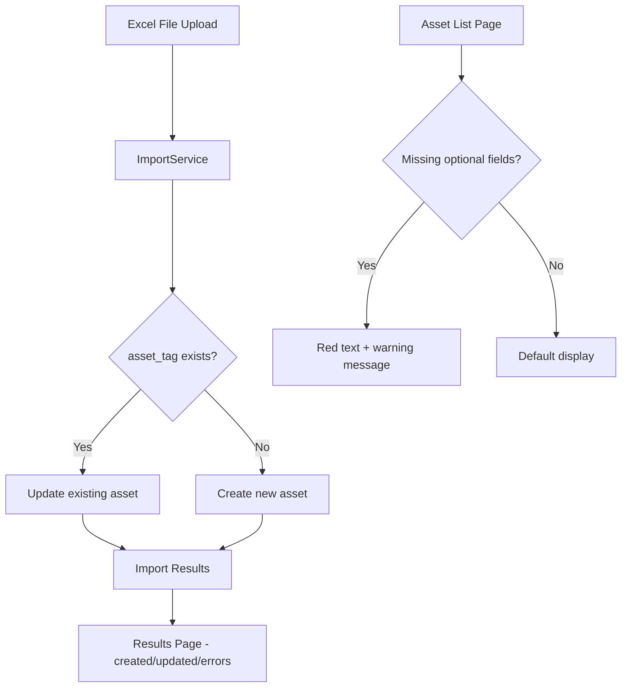

# Design Document: Lenient Asset Import

## Overview

This design modifies the existing `ImportService` to support lenient validation and upsert logic. Currently, the import rejects rows missing `ip_address`, `team`, or `assigned_to`. The new behavior:

1. Only requires `asset_tag`, `system_type`, and `operating_system` — all other fields are optional.
2. Supports upsert: if an `asset_tag` already exists, update the existing record (without overwriting populated fields with empty values).
3. Reports separate counts for created vs updated assets in the import results.
4. Displays red warning text on the asset list page for missing optional fields (`ip_address`, `assigned_to`, `team`).

No model changes are needed — `ip_address`, `assigned_to`, and `team` are already nullable on the `Asset` model.

## Architecture

The changes are confined to three layers:



The changes touch:
- `assets/services/import_service.py` — validation + upsert logic
- `assets/views.py` — `AssetImportView` and `AssetImportResultsView` to pass created/updated counts
- `assets/templates/assets/asset_import_results.html` — display created vs updated counts
- `assets/templates/assets/asset_list.html` — missing field warnings
- `assets/static/assets/css/styles.css` — `.missing-field` CSS class

## Components and Interfaces

### ImportService Changes

#### `validate_headers(headers)` 
**Current**: Requires `asset_tag`, `system_type`, `operating_system`, `ip_address`.  
**New**: Requires only `asset_tag`, `system_type`, `operating_system`. Optional columns (`ip_address`, `team`, `assigned_to`) are accepted but not required.

```python
def validate_headers(self, headers: List[str]) -> Tuple[bool, List[str]]:
    required_columns = ['asset_tag', 'system_type', 'operating_system']
    # ip_address, team, assigned_to are optional
```

#### `validate_row(row_data, row_number)`
**Current**: Rejects rows missing `ip_address`, rejects duplicate `asset_tag`.  
**New**: 
- Removes the "IP address is required" check — `ip_address` is optional.
- Removes the "Asset tag already exists" rejection — existing tags trigger update path.
- Keeps validation for: empty `asset_tag`, empty `system_type`, empty `operating_system`, invalid `system_type` value, OS not found, team not found, IP already assigned to *another* asset.
- Returns an additional flag indicating whether the asset_tag already exists (for upsert routing).

```python
def validate_row(self, row_data: Dict[str, Any], row_number: int) -> Tuple[bool, List[str], bool]:
    """Returns (is_valid, errors, is_update)"""
```

#### `import_assets(file, user)`
**Current**: Returns `{success_count, error_count, errors}`.  
**New**: Returns `{created_count, updated_count, error_count, errors}`.

The method will:
1. For new `asset_tag`: call `AssetService.create_asset()` with available data (nulls for missing optional fields).
2. For existing `asset_tag`: call `AssetService.update_asset()` with only non-empty fields from the Excel row, preserving existing populated values.

```python
def import_assets(self, file, user) -> Dict[str, Any]:
    # ...
    return {
        'created_count': created_count,
        'updated_count': updated_count,
        'error_count': error_count,
        'errors': errors
    }
```

#### Upsert Field Preservation Logic

When updating an existing asset, for each optional field:
- If the Excel cell has a non-empty value → update the field.
- If the Excel cell is empty/null AND the existing field is populated → keep the existing value (do not overwrite).
- If the Excel cell is empty/null AND the existing field is also empty → leave as-is.

For IP address updates specifically:
- If a new valid IP is provided → release old IP, assign new IP via `IPManagementService.change_asset_ip()`.
- If IP cell is empty → keep existing IP (don't release it).

### View Changes

#### `AssetImportView.post()`
Update the session storage and messages to use `created_count` and `updated_count` instead of `success_count`.

#### `AssetImportResultsView.get()`
Pass `created_count` and `updated_count` to the template context.

### Template Changes

#### `asset_import_results.html`
Display separate counts:
```
✓ 5 asset(s) created, 3 asset(s) updated.
✗ 2 row(s) had errors.
```

#### `asset_list.html`
For each asset row, check if optional fields are missing and apply the `missing-field` CSS class with warning text:

```html
<td class="missing-field">
    {{ asset.ip_address.address }}
    {{ asset.manual_ip }}
    IP is missing
</td>
```

Same pattern for `assigned_to` ("User is missing") and `team` ("Team is missing").

### CSS Changes

Add to `styles.css`:
```css
.missing-field {
    color: #dc3545;
}
```

## Data Models

No model changes required. The existing `Asset` model already supports the needed nullability:

| Field | Type | Nullable | Required for Import |
|-------|------|----------|-------------------|
| `asset_tag` | CharField(unique) | No | Yes |
| `system_type` | CharField(choices) | No | Yes |
| `operating_system` | ForeignKey(OperatingSystem) | No | Yes |
| `ip_address` | ForeignKey(IPAddress) | Yes | No |
| `assigned_to` | CharField | Yes | No |
| `team` | ForeignKey(Team) | Yes | No |
| `hardware_serial_number` | CharField | Yes | No |
| `particulars` | TextField | Yes | No |
| `warranty_expiration` | DateField | Yes | No |


## Correctness Properties

*A property is a characteristic or behavior that should hold true across all valid executions of a system — essentially, a formal statement about what the system should do. Properties serve as the bridge between human-readable specifications and machine-verifiable correctness guarantees.*

### Property 1: Required field validation rejects rows with missing required fields

*For any* import row where `asset_tag`, `system_type`, or `operating_system` is empty or missing, `validate_row` should return invalid with an error message identifying the specific missing field ("Asset tag is required", "System type is required", or "Operating system is required").

**Validates: Requirements 1.1, 1.2, 1.3, 1.4**

### Property 2: Optional fields accepted as null

*For any* import row with valid `asset_tag`, `system_type`, and `operating_system`, but missing `ip_address`, `assigned_to`, or `team`, the import should accept the row and the resulting asset should have null values for the missing optional fields.

**Validates: Requirements 1.5, 1.6, 1.7**

### Property 3: Invalid system_type rejection

*For any* string that is not "Desktop", "Laptop", or "All-in-One PC", `validate_row` should return invalid with error message "Invalid system type. Must be Desktop, Laptop, or All-in-One PC".

**Validates: Requirements 1.8**

### Property 4: Invalid operating_system rejection

*For any* operating system name that does not exist in the database, `validate_row` should return invalid with error message "Operating System not found".

**Validates: Requirements 1.9**

### Property 5: Invalid team rejection

*For any* team name that does not exist in the database, `validate_row` should return invalid with error message "Team not found".

**Validates: Requirements 1.10**

### Property 6: Assigned IP rejection

*For any* IP address that is already assigned to another asset, `validate_row` should return invalid with error message "IP address not available".

**Validates: Requirements 1.11**

### Property 7: Header validation requires only required columns

*For any* set of Excel headers, `validate_headers` should return valid if and only if the set contains `asset_tag`, `system_type`, and `operating_system`. Missing optional columns (`ip_address`, `team`, `assigned_to`) should not cause rejection, and missing optional columns should be treated as null values for all rows.

**Validates: Requirements 2.1, 2.2, 2.3, 2.4, 2.5**

### Property 8: Upsert update applies non-empty fields

*For any* existing asset and any import row with the same `asset_tag` containing non-empty values for optional fields, after import the existing asset's fields should be updated to match the non-empty values from the import row.

**Validates: Requirements 3.1**

### Property 9: Upsert field preservation — empty values do not overwrite populated fields

*For any* existing asset with populated optional fields (`ip_address`, `assigned_to`, `team`), importing a row with the same `asset_tag` but empty values for those fields should leave the existing field values unchanged.

**Validates: Requirements 3.2, 3.4**

### Property 10: IP release and reassign on update

*For any* existing asset with an assigned IP address, when an import row provides a different valid IP address, the old IP should be released (marked as unassigned) and the new IP should be assigned to the asset.

**Validates: Requirements 3.3**

### Property 11: Upsert create path

*For any* import row with a valid `asset_tag` that does not exist in the database and valid required fields, the import should create a new asset record with the provided data.

**Validates: Requirements 3.5**

### Property 12: Accurate created and updated counts

*For any* import file containing a mix of new and existing `asset_tag` values, the returned `created_count` should equal the number of new asset_tags successfully processed, and `updated_count` should equal the number of existing asset_tags successfully processed, and `created_count + updated_count + error_count` should equal the total number of non-empty rows.

**Validates: Requirements 3.6**

## Error Handling

| Scenario | Behavior |
|----------|----------|
| Excel file cannot be parsed (corrupt/wrong format) | Return error: "Error processing file: {details}" |
| Empty Excel file (no data rows) | Return error: "Excel file is empty" |
| Missing required column in headers | Return error: "Missing required column: {column_name}" for each missing column |
| Row missing `asset_tag` | Skip row, add to errors: "Asset tag is required" |
| Row missing `system_type` | Skip row, add to errors: "System type is required" |
| Row missing `operating_system` | Skip row, add to errors: "Operating system is required" |
| Invalid `system_type` value | Skip row, add to errors: "Invalid system type. Must be Desktop, Laptop, or All-in-One PC" |
| `operating_system` not in DB | Skip row, add to errors: "Operating System not found" |
| `team` not in DB | Skip row, add to errors: "Team not found" |
| `ip_address` already assigned to another asset | Skip row, add to errors: "IP address not available" |
| Unexpected exception during row processing | Skip row, add to errors with exception message |
| All rows fail validation | Return `created_count: 0, updated_count: 0, error_count: N` |

The entire import runs inside a `transaction.atomic()` block. If an unexpected exception occurs at the file level, the transaction rolls back and an error is returned.

## Testing Strategy

### Property-Based Testing

Use **Hypothesis** (already in use in the project — see `assets/tests/test_import_properties.py`) for property-based tests.

Each property from the Correctness Properties section maps to one property-based test. Tests should run a minimum of 100 iterations each.

Each test must be tagged with a comment:
```python
# Feature: lenient-asset-import, Property {N}: {property_text}
```

Key generators needed:
- Random asset_tag strings (valid format: "BIDC" + number)
- Random system_type values (both valid and invalid)
- Random operating_system names (both existing and non-existing)
- Random team names (both existing and non-existing)
- Random IP addresses (both free and assigned)
- Random Excel row dicts with various combinations of present/missing fields
- Random existing assets for upsert testing

### Unit Tests

Unit tests complement property tests for specific examples and edge cases:

- **Import results display**: Verify the template renders created_count and updated_count separately (Requirements 4.1-4.5)
- **Missing field warnings**: Verify the asset list template renders `missing-field` CSS class and warning text for assets with null optional fields (Requirements 5.1-5.5)
- **Complete asset display**: Verify no warning indicators for fully populated assets (Requirement 5.4)
- **Model constraints**: Verify `system_type` and `operating_system` remain non-null, `asset_tag` remains unique, optional fields remain nullable (Requirements 6.1-6.4)
- **CSS class**: Verify `.missing-field` class exists with `color: #dc3545` (Requirement 5.5)

### Test File Organization

- `assets/tests/test_import_properties.py` — Update/extend with new property-based tests for lenient import
- `assets/tests/test_views.py` — Add unit tests for import results display and missing field warnings
- `assets/tests/test_templates.py` — Add template rendering tests for missing field indicators
