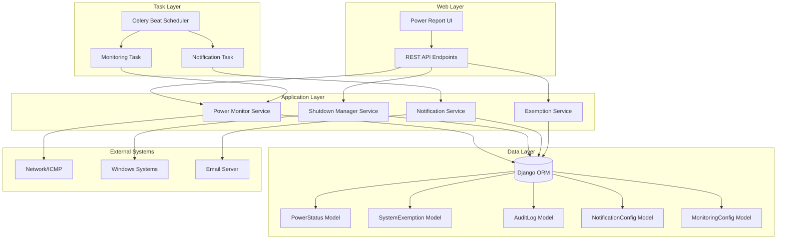
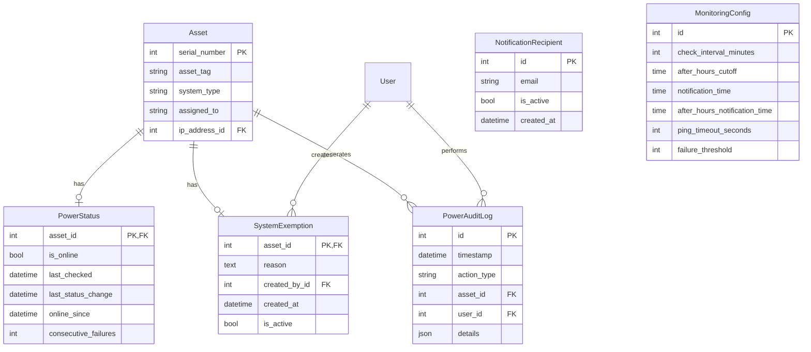

# Design Document: System Power Monitoring

## Overview

The System Power Monitoring feature provides automated tracking and management of computer systems' power status within the Asset Tracker application. The system monitors which computers are powered on, identifies systems left running after hours, enables remote shutdown capabilities, and sends email notifications to administrators. This feature integrates with the existing Asset model and leverages Django's ORM, Celery for scheduled tasks, and network connectivity checks to enforce power management policies.

### Key Capabilities

- Automated power status monitoring via network connectivity checks (ICMP ping)
- Real-time web interface displaying powered-on systems with user and network details
- Remote shutdown capability for Windows systems via network commands
- Email notifications for systems left powered on, with special handling for after-hours systems
- Exemption management for critical systems that must remain operational
- Comprehensive audit logging of all power monitoring actions
- Configurable monitoring schedules and notification windows

### Integration Points

- Extends existing Asset model with power monitoring relationships
- Integrates with IPAddress model for network connectivity checks
- Uses Celery Beat for scheduled monitoring tasks
- Leverages Django's email backend for notifications
- Provides REST API endpoints for frontend integration

## Architecture

### System Components



### Component Responsibilities

**Power Monitor Service**: Executes network connectivity checks against Asset IP addresses, records power status changes, identifies after-hours systems, and maintains status timestamps.

**Shutdown Manager Service**: Validates shutdown permissions, executes remote shutdown commands via Windows shutdown utility, prevents shutdown of exempt systems, and logs all shutdown attempts.

**Notification Service**: Identifies systems requiring notification, formats and sends email alerts, manages recipient lists, and schedules notifications based on configured windows.

**Exemption Service**: Manages system exemption designations, validates exemption reasons, tracks exemption history, and enforces exemption rules across other services.

### Technology Stack

- **Backend Framework**: Django 4.2.28
- **Task Scheduler**: Celery with Celery Beat
- **Database**: SQLite (development) / PostgreSQL (production recommended)
- **Network Monitoring**: Python subprocess with ping command
- **Remote Shutdown**: Windows shutdown command via subprocess
- **Email**: Django email backend (SMTP)
- **API**: Django REST Framework

## Components and Interfaces

### Database Models

#### PowerStatus Model

Tracks the current and historical power status of each asset.

```python
class PowerStatus(models.Model):
    """Tracks power status for monitored assets."""
    
    asset = models.OneToOneField(
        'assets.Asset',
        on_delete=models.CASCADE,
        related_name='power_status',
        primary_key=True
    )
    is_online = models.BooleanField(default=False, db_index=True)
    last_checked = models.DateTimeField(auto_now=True, db_index=True)
    last_status_change = models.DateTimeField(auto_now_add=True, db_index=True)
    online_since = models.DateTimeField(null=True, blank=True)
    consecutive_failures = models.IntegerField(default=0)
    
    class Meta:
        verbose_name_plural = "Power Statuses"
        indexes = [
            models.Index(fields=['is_online', 'last_checked']),
        ]
```

**Fields**:
- `asset`: One-to-one relationship with Asset model
- `is_online`: Current power status (True = online, False = offline)
- `last_checked`: Timestamp of most recent status check
- `last_status_change`: Timestamp when status last changed from online to offline or vice versa
- `online_since`: Timestamp when system came online (null if offline)
- `consecutive_failures`: Counter for failed ping attempts (helps distinguish temporary network issues)

#### SystemExemption Model

Manages exemptions for critical systems that should not be shut down or flagged.

```python
class SystemExemption(models.Model):
    """Tracks systems exempt from power monitoring actions."""
    
    asset = models.OneToOneField(
        'assets.Asset',
        on_delete=models.CASCADE,
        related_name='exemption',
        primary_key=True
    )
    reason = models.TextField(help_text="Justification for exemption")
    created_by = models.ForeignKey(
        'auth.User',
        on_delete=models.PROTECT,
        related_name='created_exemptions'
    )
    created_at = models.DateTimeField(auto_now_add=True)
    is_active = models.BooleanField(default=True, db_index=True)
    
    class Meta:
        verbose_name_plural = "System Exemptions"
```

**Fields**:
- `asset`: One-to-one relationship with Asset model
- `reason`: Text explanation for why system is exempt
- `created_by`: Administrator who created the exemption
- `created_at`: Timestamp of exemption creation
- `is_active`: Whether exemption is currently active (allows soft deletion)

#### PowerAuditLog Model

Comprehensive audit trail for all power monitoring actions.

```python
class PowerAuditLog(models.Model):
    """Audit log for power monitoring actions."""
    
    ACTION_TYPES = [
        ('status_change', 'Status Change'),
        ('shutdown_attempt', 'Shutdown Attempt'),
        ('shutdown_success', 'Shutdown Success'),
        ('shutdown_failure', 'Shutdown Failure'),
        ('exemption_added', 'Exemption Added'),
        ('exemption_removed', 'Exemption Removed'),
        ('notification_sent', 'Notification Sent'),
    ]
    
    timestamp = models.DateTimeField(auto_now_add=True, db_index=True)
    action_type = models.CharField(max_length=20, choices=ACTION_TYPES, db_index=True)
    asset = models.ForeignKey(
        'assets.Asset',
        on_delete=models.CASCADE,
        related_name='power_audit_logs',
        null=True,
        blank=True
    )
    user = models.ForeignKey(
        'auth.User',
        on_delete=models.SET_NULL,
        null=True,
        blank=True,
        related_name='power_actions'
    )
    details = models.JSONField(default=dict)
    
    class Meta:
        ordering = ['-timestamp']
        indexes = [
            models.Index(fields=['-timestamp', 'action_type']),
            models.Index(fields=['asset', '-timestamp']),
        ]
```

**Fields**:
- `timestamp`: When the action occurred
- `action_type`: Type of action from predefined choices
- `asset`: Related asset (null for system-wide actions like notifications)
- `user`: User who performed the action (null for automated actions)
- `details`: JSON field for action-specific data (e.g., failure reasons, recipient lists)

#### NotificationRecipient Model

Manages email recipients for power monitoring notifications.

```python
class NotificationRecipient(models.Model):
    """Email recipients for power monitoring notifications."""
    
    email = models.EmailField(unique=True)
    is_active = models.BooleanField(default=True, db_index=True)
    created_at = models.DateTimeField(auto_now_add=True)
    
    class Meta:
        ordering = ['email']
```

**Fields**:
- `email`: Email address (validated, unique)
- `is_active`: Whether recipient should receive notifications
- `created_at`: When recipient was added

#### MonitoringConfig Model

Singleton model for system-wide monitoring configuration.

```python
class MonitoringConfig(models.Model):
    """Singleton configuration for power monitoring system."""
    
    check_interval_minutes = models.IntegerField(
        default=15,
        validators=[MinValueValidator(1), MaxValueValidator(1440)],
        help_text="Interval between power status checks (1-1440 minutes)"
    )
    after_hours_cutoff = models.TimeField(
        default=time(20, 30),
        help_text="Time after which systems are considered 'after hours' (default 8:30 PM)"
    )
    notification_time = models.TimeField(
        default=time(17, 30),
        help_text="Time to send daily notification email (default 5:30 PM)"
    )
    after_hours_notification_time = models.TimeField(
        default=time(20, 45),
        help_text="Time to send after-hours notification (default 8:45 PM)"
    )
    ping_timeout_seconds = models.IntegerField(
        default=2,
        validators=[MinValueValidator(1), MaxValueValidator(10)]
    )
    failure_threshold = models.IntegerField(
        default=3,
        validators=[MinValueValidator(1), MaxValueValidator(10)],
        help_text="Number of consecutive failures before marking offline"
    )
    
    class Meta:
        verbose_name_plural = "Monitoring Configurations"
    
    def save(self, *args, **kwargs):
        """Ensure only one configuration exists."""
        self.pk = 1
        super().save(*args, **kwargs)
    
    @classmethod
    def get_config(cls):
        """Get or create the singleton configuration."""
        config, created = cls.objects.get_or_create(pk=1)
        return config
```

**Fields**:
- `check_interval_minutes`: How often to check power status
- `after_hours_cutoff`: Time threshold for after-hours detection
- `notification_time`: When to send daily notifications
- `after_hours_notification_time`: When to send after-hours notifications
- `ping_timeout_seconds`: Timeout for network connectivity checks
- `failure_threshold`: Consecutive failures before marking offline

### Service Layer

#### PowerMonitorService

```python
class PowerMonitorService:
    """Service for monitoring asset power status."""
    
    @staticmethod
    def check_asset_status(asset: Asset) -> bool:
        """
        Check if an asset is online via network ping.
        
        Args:
            asset: Asset to check
            
        Returns:
            bool: True if online, False if offline
        """
        
    @staticmethod
    def update_power_status(asset: Asset, is_online: bool) -> PowerStatus:
        """
        Update power status for an asset and log changes.
        
        Args:
            asset: Asset to update
            is_online: New online status
            
        Returns:
            PowerStatus: Updated power status object
        """
        
    @staticmethod
    def check_all_assets() -> dict:
        """
        Check power status for all active assets with IP addresses.
        
        Returns:
            dict: Summary of check results
        """
        
    @staticmethod
    def get_online_assets(exclude_exempt: bool = True) -> QuerySet:
        """
        Get all currently online assets.
        
        Args:
            exclude_exempt: Whether to exclude exempt systems
            
        Returns:
            QuerySet: Online assets
        """
        
    @staticmethod
    def get_after_hours_assets() -> QuerySet:
        """
        Get assets online after the configured cutoff time.
        
        Returns:
            QuerySet: After-hours assets
        """
```

#### ShutdownManagerService

```python
class ShutdownManagerService:
    """Service for managing remote system shutdowns."""
    
    @staticmethod
    def can_shutdown(asset: Asset, user: User) -> tuple[bool, str]:
        """
        Check if user can shutdown an asset.
        
        Args:
            asset: Asset to check
            user: User requesting shutdown
            
        Returns:
            tuple: (can_shutdown, reason)
        """
        
    @staticmethod
    def shutdown_asset(asset: Asset, user: User) -> tuple[bool, str]:
        """
        Execute remote shutdown command on an asset.
        
        Args:
            asset: Asset to shutdown
            user: User requesting shutdown
            
        Returns:
            tuple: (success, message)
        """
        
    @staticmethod
    def bulk_shutdown(assets: list[Asset], user: User) -> dict:
        """
        Shutdown multiple assets.
        
        Args:
            assets: List of assets to shutdown
            user: User requesting shutdown
            
        Returns:
            dict: Summary of shutdown results
        """
```

#### NotificationService

```python
class NotificationService:
    """Service for sending power monitoring notifications."""
    
    @staticmethod
    def get_active_recipients() -> list[str]:
        """
        Get list of active notification recipient emails.
        
        Returns:
            list: Email addresses
        """
        
    @staticmethod
    def send_daily_notification() -> bool:
        """
        Send daily notification about online systems.
        
        Returns:
            bool: True if sent successfully
        """
        
    @staticmethod
    def send_after_hours_notification() -> bool:
        """
        Send notification about after-hours systems.
        
        Returns:
            bool: True if sent successfully
        """
        
    @staticmethod
    def format_notification_email(assets: QuerySet, is_after_hours: bool = False) -> tuple[str, str]:
        """
        Format notification email subject and body.
        
        Args:
            assets: Assets to include in notification
            is_after_hours: Whether this is an after-hours notification
            
        Returns:
            tuple: (subject, html_body)
        """
```

#### ExemptionService

```python
class ExemptionService:
    """Service for managing system exemptions."""
    
    @staticmethod
    def create_exemption(asset: Asset, reason: str, user: User) -> SystemExemption:
        """
        Create exemption for an asset.
        
        Args:
            asset: Asset to exempt
            reason: Justification for exemption
            user: User creating exemption
            
        Returns:
            SystemExemption: Created exemption
        """
        
    @staticmethod
    def remove_exemption(asset: Asset, user: User) -> bool:
        """
        Remove exemption from an asset.
        
        Args:
            asset: Asset to remove exemption from
            user: User removing exemption
            
        Returns:
            bool: True if removed successfully
        """
        
    @staticmethod
    def is_exempt(asset: Asset) -> bool:
        """
        Check if asset is currently exempt.
        
        Args:
            asset: Asset to check
            
        Returns:
            bool: True if exempt
        """
```

### Celery Tasks

#### Monitoring Task

```python
@shared_task
def check_power_status_task():
    """
    Periodic task to check power status of all assets.
    Runs at configured interval.
    """
    from power_monitoring.services import PowerMonitorService
    
    result = PowerMonitorService.check_all_assets()
    logger.info(f"Power status check completed: {result}")
    return result
```

#### Notification Tasks

```python
@shared_task
def send_daily_notification_task():
    """
    Task to send daily power monitoring notification.
    Runs at configured notification time.
    """
    from power_monitoring.services import NotificationService
    
    success = NotificationService.send_daily_notification()
    return {'success': success}

@shared_task
def send_after_hours_notification_task():
    """
    Task to send after-hours notification.
    Runs shortly after configured after-hours cutoff.
    """
    from power_monitoring.services import NotificationService
    
    success = NotificationService.send_after_hours_notification()
    return {'success': success}
```

### REST API Endpoints

#### Power Status Endpoints

```
GET /api/power-monitoring/status/
    - List all power statuses
    - Query params: online_only, exclude_exempt, after_hours_only
    - Returns: List of power status objects with asset details

GET /api/power-monitoring/status/<asset_id>/
    - Get power status for specific asset
    - Returns: Power status object

POST /api/power-monitoring/check/
    - Trigger immediate power status check for all assets
    - Requires: staff permission
    - Returns: Check summary

POST /api/power-monitoring/check/<asset_id>/
    - Trigger immediate check for specific asset
    - Requires: staff permission
    - Returns: Updated power status
```

#### Shutdown Endpoints

```
POST /api/power-monitoring/shutdown/<asset_id>/
    - Shutdown specific asset
    - Requires: staff permission
    - Body: None
    - Returns: Success status and message

POST /api/power-monitoring/shutdown/bulk/
    - Shutdown multiple assets
    - Requires: staff permission
    - Body: {"asset_ids": [1, 2, 3]}
    - Returns: Bulk operation summary
```

#### Exemption Endpoints

```
GET /api/power-monitoring/exemptions/
    - List all exemptions
    - Returns: List of exemption objects

POST /api/power-monitoring/exemptions/
    - Create new exemption
    - Requires: staff permission
    - Body: {"asset_id": 1, "reason": "Database server"}
    - Returns: Created exemption

DELETE /api/power-monitoring/exemptions/<asset_id>/
    - Remove exemption
    - Requires: staff permission
    - Returns: Success status
```

#### Configuration Endpoints

```
GET /api/power-monitoring/config/
    - Get monitoring configuration
    - Returns: Configuration object

PUT /api/power-monitoring/config/
    - Update monitoring configuration
    - Requires: staff permission
    - Body: Configuration fields
    - Returns: Updated configuration

GET /api/power-monitoring/recipients/
    - List notification recipients
    - Returns: List of recipients

POST /api/power-monitoring/recipients/
    - Add notification recipient
    - Requires: staff permission
    - Body: {"email": "admin@example.com"}
    - Returns: Created recipient

DELETE /api/power-monitoring/recipients/<id>/
    - Remove recipient
    - Requires: staff permission
    - Returns: Success status

PATCH /api/power-monitoring/recipients/<id>/
    - Toggle recipient active status
    - Requires: staff permission
    - Body: {"is_active": false}
    - Returns: Updated recipient
```

#### Audit Log Endpoints

```
GET /api/power-monitoring/audit-logs/
    - List audit logs
    - Query params: start_date, end_date, asset_id, action_type
    - Returns: Paginated list of audit logs

GET /api/power-monitoring/audit-logs/<id>/
    - Get specific audit log entry
    - Returns: Audit log object
```

### Web Interface Views

#### Power Report Page

```
URL: /power-monitoring/report/
Template: power_monitoring/report.html
Context:
    - online_assets: Assets currently online
    - after_hours_assets: Assets online after hours
    - exempt_assets: Exempt systems (optional view)
    - config: Monitoring configuration
    - last_check: Timestamp of last check
```

#### Configuration Page

```
URL: /power-monitoring/config/
Template: power_monitoring/config.html
Context:
    - config_form: MonitoringConfig form
    - recipients: List of notification recipients
    - recipient_form: NotificationRecipient form
```

#### Audit Log Page

```
URL: /power-monitoring/audit/
Template: power_monitoring/audit.html
Context:
    - logs: Paginated audit logs
    - filter_form: Date/asset/action filters
```

## Data Models

### Entity Relationship Diagram



### Data Flow

**Power Status Check Flow**:
1. Celery Beat triggers `check_power_status_task` at configured interval
2. Task calls `PowerMonitorService.check_all_assets()`
3. Service queries all active Assets with IP addresses
4. For each asset, service executes ping command
5. Service updates PowerStatus record based on ping result
6. If status changed, service creates PowerAuditLog entry
7. Service returns summary of check results

**Shutdown Flow**:
1. User clicks shutdown button in UI
2. Frontend calls POST `/api/power-monitoring/shutdown/<asset_id>/`
3. API view calls `ShutdownManagerService.can_shutdown()`
4. If authorized and not exempt, service executes shutdown command
5. Service creates PowerAuditLog entry with result
6. Service updates PowerStatus if successful
7. API returns result to frontend

**Notification Flow**:
1. Celery Beat triggers notification task at configured time
2. Task calls `NotificationService.send_daily_notification()`
3. Service queries online non-exempt assets
4. Service formats email with asset details
5. Service sends email to all active recipients
6. Service creates PowerAuditLog entry
7. Task returns success status


## Correctness Properties

*A property is a characteristic or behavior that should hold true across all valid executions of a system-essentially, a formal statement about what the system should do. Properties serve as the bridge between human-readable specifications and machine-verifiable correctness guarantees.*

### Property Reflection

After analyzing all acceptance criteria, several redundancies were identified:
- Criteria 2.5 and 6.5 both test that exempt assets are indicated on the report page
- Criteria 3.3 and 6.7 both test that exempt systems cannot be shut down
- Criteria 2.10 and 8.4 both test filtering to show only after-hours assets
- Criteria 3.4 and 9.2 both test shutdown audit logging

These have been consolidated into single comprehensive properties to avoid redundant testing.

### Property 1: Power Status Check Coverage

*For any* active asset with an IP address, when the power monitoring check runs, the system should check that asset's power status.

**Validates: Requirements 1.1**

### Property 2: Online Status Recording

*For any* asset that responds to a network connectivity check, the system should record the power status as online.

**Validates: Requirements 1.2**

### Property 3: Offline Status Recording

*For any* asset that does not respond to a network connectivity check, the system should record the power status as offline.

**Validates: Requirements 1.3**

### Property 4: Last Check Timestamp Update

*For any* asset that undergoes a power status check, the last_checked timestamp should be updated to the current time.

**Validates: Requirements 1.4**

### Property 5: Status Change Timestamp Update

*For any* asset whose power status changes from online to offline or offline to online, the last_status_change timestamp should be updated.

**Validates: Requirements 1.5**

### Property 6: Exempt System Monitoring

*For any* asset marked as exempt, the system should still track its power status and maintain a power status record.

**Validates: Requirements 1.6**

### Property 7: Online Assets Display

*For any* asset with online power status, that asset should appear in the power report page's list of online systems.

**Validates: Requirements 2.1**

### Property 8: User Name Display

*For any* online asset displayed on the power report page, the assigned user name should be included in the rendered output.

**Validates: Requirements 2.2**

### Property 9: IP Address Display

*For any* online asset displayed on the power report page, the IP address should be included in the rendered output.

**Validates: Requirements 2.3**

### Property 10: Online Duration Display

*For any* online asset displayed on the power report page, the duration the system has been online should be calculated and displayed.

**Validates: Requirements 2.4**


### Property 11: Exempt Status Indication

*For any* exempt asset, the power report page should clearly indicate the exemption status in the display.

**Validates: Requirements 2.5, 6.5**

### Property 12: Exempt System Exclusion from Default View

*For any* exempt asset, by default it should not appear in the main power report list unless the user specifically requests to view exempt systems.

**Validates: Requirements 2.6**

### Property 13: After-Hours Highlighting

*For any* asset that is online when the current time is after the configured after-hours cutoff, that asset should be highlighted or marked as an after-hours system.

**Validates: Requirements 2.9**

### Property 14: After-Hours Filter

*For any* query with the after-hours filter applied, only assets that are online after the configured cutoff time should be returned.

**Validates: Requirements 2.10, 8.4**

### Property 15: Shutdown Command Execution

*For any* non-exempt asset with an IP address, when an authorized administrator requests shutdown, a shutdown command should be sent to that asset's IP address.

**Validates: Requirements 3.1**

### Property 16: Shutdown Authorization

*For any* shutdown request, the system should verify that the requesting user has staff permissions before executing the shutdown command.

**Validates: Requirements 3.2**

### Property 17: Exempt System Shutdown Prevention

*For any* asset marked as exempt, shutdown requests should be blocked and a warning message should be returned.

**Validates: Requirements 3.3, 6.7**

### Property 18: Shutdown Audit Logging

*For any* shutdown attempt, an audit log entry should be created containing the timestamp, administrator identity, target asset, and result.

**Validates: Requirements 3.4, 9.2**

### Property 19: Shutdown Failure Recording

*For any* shutdown command that fails, the failure reason should be recorded in the audit log and the administrator should be notified.

**Validates: Requirements 3.5**

### Property 20: Successful Shutdown Status Update

*For any* successful shutdown command, the target asset's power status should be updated to offline.

**Validates: Requirements 3.6**

### Property 21: Bulk Shutdown Execution

*For any* set of assets selected for bulk shutdown, all non-exempt assets in that set should receive shutdown commands.

**Validates: Requirements 3.7**

### Property 22: Notification Asset Identification

*For any* notification check, the system should identify all non-exempt assets with online power status.

**Validates: Requirements 4.1**

### Property 23: Email Sending on Online Assets

*For any* notification check where online assets are detected, an email should be sent to all configured active recipients.

**Validates: Requirements 4.2**


### Property 24: Email Content - User Names

*For any* online asset included in a notification email, the asset's assigned user name should appear in the email content.

**Validates: Requirements 4.3**

### Property 25: Email Content - IP Addresses

*For any* online asset included in a notification email, the asset's IP address should appear in the email content.

**Validates: Requirements 4.4**

### Property 26: Email Content - Online Duration

*For any* online asset included in a notification email, the duration the asset has been online should be calculated and included in the email content.

**Validates: Requirements 4.5**

### Property 27: Notification Scheduling

*For any* notification email, it should only be sent during the configured notification time windows.

**Validates: Requirements 4.7**

### Property 28: After-Hours Asset Prioritization

*For any* notification email sent when the current time is after the after-hours cutoff, after-hours assets should be prioritized or highlighted in the email content.

**Validates: Requirements 4.8**

### Property 29: After-Hours Status in Email

*For any* after-hours asset included in a notification email, the email should clearly indicate that the system is powered on after the cutoff time.

**Validates: Requirements 4.9**

### Property 30: Recipient List Persistence

*For any* notification recipient added to the system, that recipient should be stored and retrievable from the recipient list.

**Validates: Requirements 5.1**

### Property 31: Multiple Recipient Support

*For any* notification email sent, all active recipients in the recipient list should receive the email.

**Validates: Requirements 5.2**

### Property 32: Email Format Validation

*For any* email address submitted as a notification recipient, the system should validate the email format and reject invalid formats.

**Validates: Requirements 5.3**

### Property 33: Recipient Removal

*For any* recipient removed from the system, that recipient should no longer appear in the recipient list.

**Validates: Requirements 5.4**

### Property 34: Default Recipient Fallback

*For any* notification when no recipients are configured, the system should use the default recipient address.

**Validates: Requirements 5.6**

### Property 35: Recipient Active Status Toggle

*For any* recipient, administrators should be able to toggle the active status without deleting the recipient record.

**Validates: Requirements 5.7**

### Property 36: Exemption Creation

*For any* asset, an administrator should be able to mark it as exempt by providing a reason.

**Validates: Requirements 6.1**


### Property 37: Exemption Removal

*For any* asset with an active exemption, an administrator should be able to remove the exemption designation.

**Validates: Requirements 6.2**

### Property 38: Exemption Reason Recording

*For any* asset marked as exempt, the system should record and store the reason for the exemption.

**Validates: Requirements 6.3**

### Property 39: Exemption Creator Recording

*For any* exemption created, the system should record which administrator created the exemption.

**Validates: Requirements 6.4**

### Property 40: Exempt Asset Notification Exclusion

*For any* notification email, exempt assets should not be included in the list of systems requiring attention.

**Validates: Requirements 6.6**

### Property 41: Check Interval Configuration

*For any* valid check interval value (between 1 and 1440 minutes), administrators should be able to configure and persist that interval.

**Validates: Requirements 7.1**

### Property 42: Notification Time Configuration

*For any* valid time value, administrators should be able to configure when notification emails are sent.

**Validates: Requirements 7.2**

### Property 43: Check Interval Validation

*For any* check interval value outside the range of 1 to 1440 minutes, the system should reject the configuration and return a validation error.

**Validates: Requirements 7.3**

### Property 44: After-Hours Cutoff Configuration

*For any* valid time value, administrators should be able to configure the after-hours cutoff time.

**Validates: Requirements 8.1**

### Property 45: After-Hours Asset Identification

*For any* non-exempt asset with online power status when the current time exceeds the configured after-hours cutoff, that asset should be identified as an after-hours system.

**Validates: Requirements 8.3**

### Property 46: After-Hours Duration Display

*For any* after-hours asset displayed on the power report page, the system should calculate and display how long the system has been on past the after-hours cutoff.

**Validates: Requirements 8.5**

### Property 47: After-Hours Notification

*For any* notification check that detects after-hours assets, a specific after-hours notification email should be sent.

**Validates: Requirements 8.6**

### Property 48: Real-Time After-Hours Flagging

*For any* asset that comes online after the configured after-hours cutoff, the system should immediately flag it as an after-hours system.

**Validates: Requirements 8.8**

### Property 49: Status Change Audit Logging

*For any* power status change (online to offline or offline to online), an audit log entry should be created with a timestamp.

**Validates: Requirements 9.1**


### Property 50: Notification Audit Logging

*For any* notification email sent, an audit log entry should be created containing the timestamp, recipient list, and number of assets reported.

**Validates: Requirements 9.3**

### Property 51: Exemption Change Audit Logging

*For any* exemption creation or removal, an audit log entry should be created with the timestamp and administrator identity.

**Validates: Requirements 9.4**

### Property 52: Audit Log Date Filtering

*For any* date range query on audit logs, only logs with timestamps within that range should be returned.

**Validates: Requirements 9.5**

### Property 53: Audit Log Asset Filtering

*For any* asset-specific query on audit logs, only logs related to that asset should be returned.

**Validates: Requirements 9.6**

### Property 54: Audit Log Action Type Filtering

*For any* action type query on audit logs, only logs matching that action type should be returned.

**Validates: Requirements 9.7**

## Error Handling

### Network Connectivity Errors

**Timeout Handling**: When a ping command times out, the system should not immediately mark the asset as offline. Instead, it should increment the consecutive_failures counter and only mark offline after reaching the configured failure_threshold. This prevents false positives from temporary network issues.

**DNS Resolution Failures**: If an IP address cannot be resolved, the system should log the error in the audit log and skip that asset for the current check cycle.

**Permission Errors**: If the system lacks permission to execute ping commands, it should log a critical error and notify administrators via email.

### Shutdown Command Errors

**Connection Refused**: If the remote system refuses the shutdown connection, log the failure with details and notify the requesting administrator.

**Authentication Failures**: If credentials are invalid for remote shutdown, log the error and provide clear feedback to the administrator.

**Timeout Errors**: If the shutdown command times out, log the timeout and mark the shutdown as failed, allowing retry.

### Email Notification Errors

**SMTP Connection Failures**: If the email server is unreachable, log the error and retry up to 3 times with exponential backoff.

**Invalid Recipient Addresses**: If an email bounces due to invalid recipient, log the error but continue sending to other recipients.

**Email Size Limits**: If the notification email exceeds size limits (e.g., too many assets), split into multiple emails or provide a summary with a link to the full report.

### Configuration Errors

**Invalid Time Values**: Validate all time configurations and reject values outside acceptable ranges with clear error messages.

**Missing Configuration**: If MonitoringConfig is missing, create it with default values rather than failing.

**Concurrent Updates**: Use database transactions to prevent race conditions when multiple administrators update configuration simultaneously.

### Database Errors

**Integrity Violations**: If a unique constraint is violated (e.g., duplicate exemption), catch the error and return a user-friendly message.

**Connection Failures**: Implement retry logic with exponential backoff for transient database connection issues.

**Transaction Rollbacks**: Ensure all multi-step operations (e.g., shutdown + status update + audit log) are wrapped in transactions that rollback on failure.


## Testing Strategy

### Dual Testing Approach

This feature requires both unit tests and property-based tests to ensure comprehensive coverage:

**Unit Tests** focus on:
- Specific examples of power status checks with known outcomes
- Edge cases like empty recipient lists, missing IP addresses, and exempt systems
- Error conditions such as network timeouts, invalid configurations, and permission failures
- Integration points between services and models
- Celery task execution and scheduling

**Property-Based Tests** focus on:
- Universal properties that hold for all inputs (e.g., "for any asset checked, last_checked timestamp updates")
- Comprehensive input coverage through randomization
- Invariants that must hold across all operations
- Round-trip properties for serialization and state transitions

Both testing approaches are complementary and necessary. Unit tests catch specific bugs and validate concrete scenarios, while property-based tests verify general correctness across a wide range of inputs.

### Property-Based Testing Configuration

**Framework**: Use `hypothesis` for Python property-based testing (already available in the project)

**Test Configuration**:
- Minimum 100 iterations per property test to ensure adequate randomization coverage
- Each property test must include a comment tag referencing the design document property
- Tag format: `# Feature: system-power-monitoring, Property {number}: {property_text}`

**Example Property Test Structure**:

```python
from hypothesis import given, settings, strategies as st
from assets.models import Asset
from power_monitoring.models import PowerStatus
from power_monitoring.services import PowerMonitorService

@given(
    asset=st.builds(Asset, ...),
    is_online=st.booleans()
)
@settings(max_examples=100)
def test_property_2_online_status_recording(asset, is_online):
    """
    Feature: system-power-monitoring, Property 2: Online Status Recording
    For any asset that responds to a network connectivity check,
    the system should record the power status as online.
    """
    # Mock network response
    with mock.patch('subprocess.run') as mock_run:
        mock_run.return_value.returncode = 0 if is_online else 1
        
        # Execute check
        PowerMonitorService.check_asset_status(asset)
        
        # Verify status recorded correctly
        status = PowerStatus.objects.get(asset=asset)
        assert status.is_online == is_online
```

### Unit Test Coverage

**Model Tests**:
- PowerStatus model field validation and constraints
- SystemExemption creation and soft deletion
- PowerAuditLog JSON field serialization
- NotificationRecipient email validation
- MonitoringConfig singleton behavior and default values

**Service Tests**:
- PowerMonitorService.check_asset_status with various network responses
- ShutdownManagerService.can_shutdown permission checks
- NotificationService.format_notification_email content generation
- ExemptionService.is_exempt with active and inactive exemptions

**API Tests**:
- Authentication and authorization for all endpoints
- Query parameter filtering (online_only, exclude_exempt, after_hours_only)
- Bulk operations with mixed exempt and non-exempt assets
- Error responses for invalid inputs

**Task Tests**:
- Celery task execution with mocked services
- Task retry logic on failures
- Task scheduling configuration

**Integration Tests**:
- End-to-end power check flow: check → status update → audit log
- End-to-end shutdown flow: request → authorization → command → status update → audit log
- End-to-end notification flow: trigger → query assets → format email → send → audit log

### Test Data Strategies

**Hypothesis Strategies**:
- `asset_strategy`: Generate valid Asset instances with IP addresses
- `time_strategy`: Generate valid time values for configuration
- `email_strategy`: Generate valid and invalid email addresses
- `duration_strategy`: Generate various online durations for testing

**Fixtures**:
- `monitoring_config`: MonitoringConfig with test-friendly values
- `online_assets`: Set of assets with online power status
- `exempt_assets`: Set of assets with active exemptions
- `after_hours_time`: Mock current time to test after-hours logic

### Mocking Strategy

**Network Operations**: Mock `subprocess.run` for ping commands to avoid actual network calls
**Email Sending**: Use Django's `django.core.mail.outbox` for testing email delivery
**Time**: Mock `timezone.now()` to test time-dependent behavior (after-hours detection)
**Celery**: Use `CELERY_TASK_ALWAYS_EAGER=True` for synchronous task execution in tests

### Performance Testing

**Load Tests**:
- Test power status check with 1000+ assets
- Test bulk shutdown with 100+ assets
- Test notification email generation with 500+ online assets

**Optimization Targets**:
- Power status check should complete in < 5 seconds for 100 assets
- Bulk shutdown should process 10 assets per second
- Notification email generation should complete in < 2 seconds for 100 assets

### Continuous Integration

**Pre-commit Checks**:
- Run all unit tests
- Run property-based tests with reduced iterations (50) for speed
- Check test coverage (target: 90%+ for new code)

**Full CI Pipeline**:
- Run all tests including property-based tests with full iterations (100+)
- Run integration tests against test database
- Generate coverage report
- Run linting and type checking

